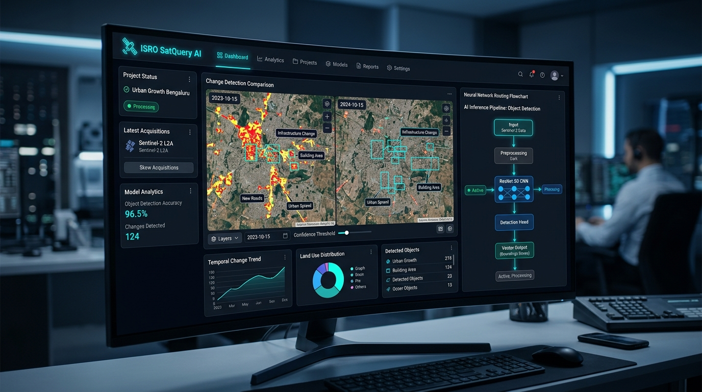
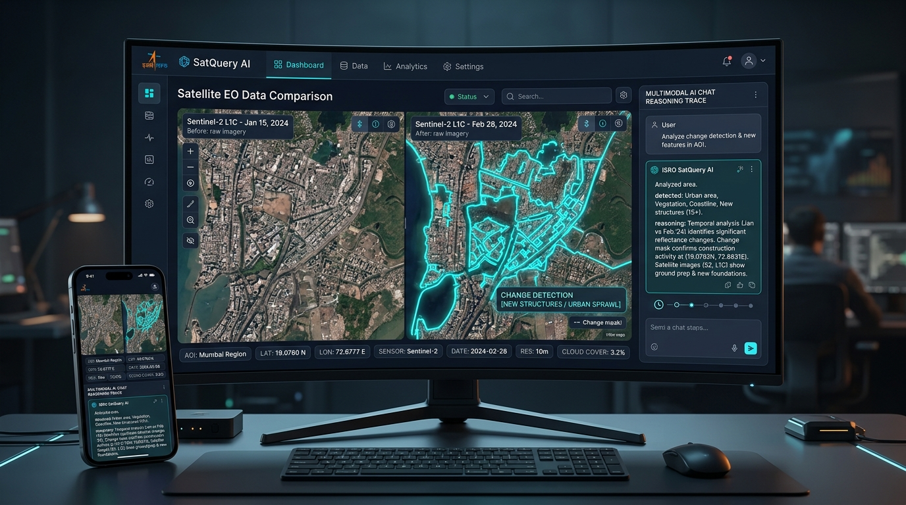
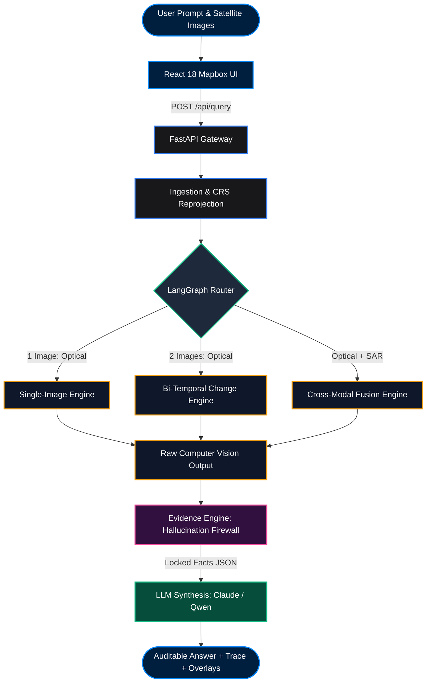
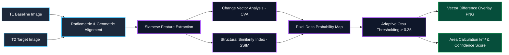
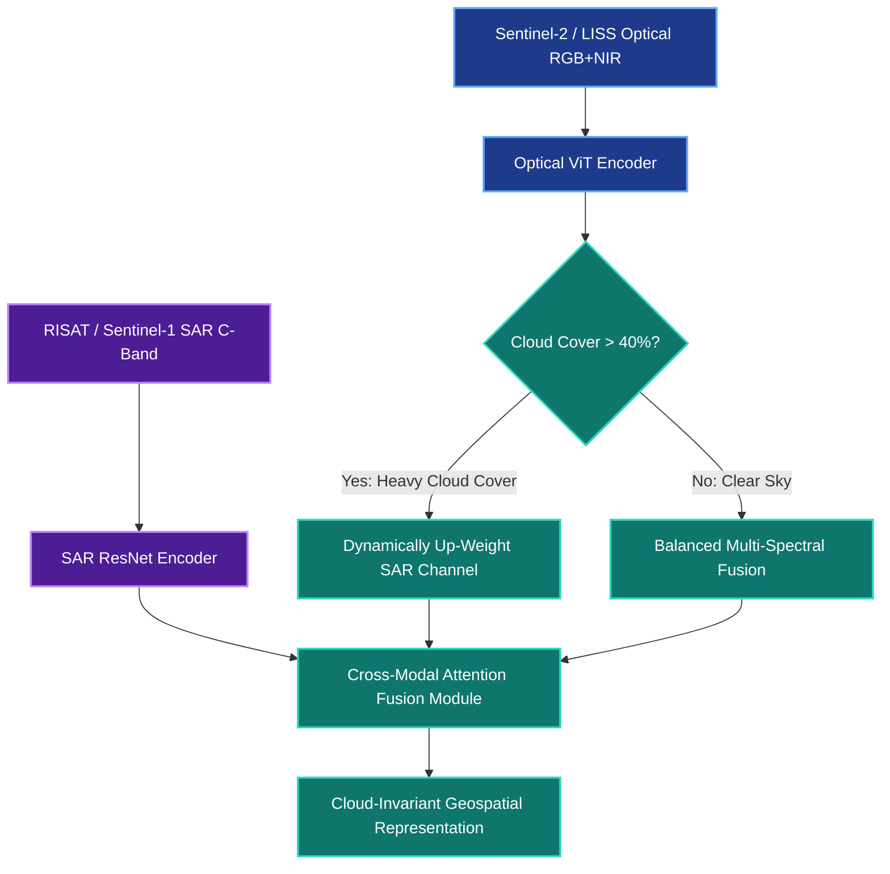

# 🛰️ ISRO SatQuery AI — Agentic Multimodal Geospatial Intelligence

<div align="center">



### **Next-Generation Remote Sensing Visual Question Answering (VQA), Bi-Temporal Change Detection & Cross-Modal Optical-SAR Fusion**

*Smart India Hackathon 2026 (SIH26167) — ISRO Space Technology Track*

<br/>

[](https://fastapi.tiangolo.com)
[](https://reactjs.org)
[](https://vitejs.dev)
[](https://www.mapbox.com)
[](https://pytorch.org)
[](https://firebase.google.com)
[](https://firebase.google.com/docs/firestore)
[](https://langchain.ai)
[](https://vercel.com)
[](LICENSE)

<br/>

[🚀 Quickstart](#-quickstart-in-3-steps) • [✨ Key Features](#-core-capabilities) • [🏛️ Architecture](#️-system-architecture--dataflow) • [🔬 ML & Colab GPU](#-machine-learning-training--colab-gpu-bridge) • [🔒 Auth & Security](#-authentication--security-hardening) • [📡 API Docs](#-api-specification--curl-playbook) • [🧪 Test Suite](#-test-suite--verification-matrix)

</div>

---

## 📌 Executive Summary

**SatQuery AI** is an enterprise-grade Earth Observation (EO) intelligence platform engineered for **ISRO Space Technology** applications. It bridges multi-spectral satellite imagery (Cartosat-2S, LISS-IV, Sentinel-2 Optical RGB/NIR/SWIR, and RISAT/Sentinel-1 SAR Radar) with Vision-Language Models (VLMs) and deep computer vision engines.

Unlike generic LLM wrappers that treat satellite scenes as standard RGB photos, SatQuery AI implements:
1. **Agentic Router (LangGraph)**: Multi-spectral modality detection, intent classification, and dynamic graph dispatch.
2. **Specialized Vision Engines**: PyTorch Siamese CNNs, SSIM difference mapping, and Optical-SAR Cross-Attention Fusion.
3. **Strict Evidence Engine (Hallucination Firewall)**: Mathematically locks quantitative facts (area in km², bounding boxes, confidence scores) before natural language synthesis.
4. **Cloud-Synced Workspace (Firebase Auth & Firestore)**: Secure Google/GitHub SSO, session persistence, and researcher analytics.
5. **GPU Acceleration Bridge**: Seamless connection to high-end GPU runtimes (T4/A100) via Google Colab & ngrok.

---

## 📸 Platform Showcase

<div align="center">


*Figure: Dual Split Synchronized Change Detection, Real-time Vector Masks, Multi-Style Satellite Explorer, and Multimodal AI Chat Reasoning Trace.*

</div>

---

## 📑 Table of Contents

- [🛰️ ISRO SatQuery AI — Agentic Multimodal Geospatial Intelligence](#️-isro-satquery-ai--agentic-multimodal-geospatial-intelligence)
  - [📌 Executive Summary](#-executive-summary)
  - [📸 Platform Showcase](#-platform-showcase)
  - [📑 Table of Contents](#-table-of-contents)
  - [⚡ Live Feature Matrix](#-live-feature-matrix)
  - [🏛️ System Architecture \& Dataflow](#️-system-architecture--dataflow)
  - [🧠 Core Capabilities](#-core-capabilities)
    - [1. Single-Image Geospatial VQA](#1-single-image-geospatial-vqa)
    - [2. Bi-Temporal Change Detection \& Siamese CNN](#2-bi-temporal-change-detection--siamese-cnn)
    - [3. Optical-SAR Cross-Modal Attention Fusion](#3-optical-sar-cross-modal-attention-fusion)
    - [4. Interactive Live Map Selection \& Strategic Corridors](#4-interactive-live-map-selection--strategic-corridors)
    - [5. Firebase Authentication \& Cloud Firestore Sync](#5-firebase-authentication--cloud-firestore-sync)
  - [📊 Interactive System Flowcharts](#-interactive-system-flowcharts)
    - [A. End-to-End Multimodal Execution Flow](#a-end-to-end-multimodal-execution-flow)
    - [B. Bi-Temporal Siamese Change Detection Pipeline](#b-bi-temporal-siamese-change-detection-pipeline)
    - [C. Optical-SAR Cross-Modal Attention Fusion Flow](#c-optical-sar-cross-modal-attention-fusion-flow)
  - [🔬 Machine Learning Training \& Colab GPU Bridge](#-machine-learning-training--colab-gpu-bridge)
    - [Option A: Google Colab Remote GPU Bridge (`colab_serve_qwen.py`)](#option-a-google-colab-remote-gpu-bridge-colab_serve_qwenpy)
    - [Option B: Local PyTorch Inference \& LoRA Fine-Tuning](#option-b-local-pytorch-inference--lora-fine-tuning)
    - [Option C: Zero-Config Standalone Simulation (Mock Mode)](#option-c-zero-config-standalone-simulation-mock-mode)
  - [🛡️ Authentication \& Security Hardening](#️-authentication--security-hardening)
  - [📡 API Specification \& cURL Playbook](#-api-specification--curl-playbook)
    - [`POST /api/query` — Multimodal Query Execution](#post-apiquery--multimodal-query-execution)
    - [`POST /api/query_by_location` — Geocoding \& Catalog Query](#post-apiquery_by_location--geocoding--catalog-query)
    - [`GET /health` — Service Status](#get-health--service-status)
  - [🧪 Test Suite \& Verification Matrix](#-test-suite--verification-matrix)
  - [📱 Mobile \& Responsive Ergonomics](#-mobile--responsive-ergonomics)
  - [🚀 Quickstart in 3 Steps](#-quickstart-in-3-steps)
    - [1. Clone Repository](#1-clone-repository)
    - [2. Start FastAPI Backend](#2-start-fastapi-backend)
    - [3. Start React Frontend](#3-start-react-frontend)
    - [1-Click Vercel Deployment](#1-click-vercel-deployment)
  - [⚙️ Environment Configuration Reference](#️-environment-configuration-reference)
  - [📂 Directory Tree](#-directory-tree)
  - [👥 Team \& Hackathon Acknowledgments](#-team--hackathon-acknowledgments)

---

## ⚡ Live Feature Matrix

| Feature Module | Technology Stack | Capabilities & Highlights | Interactive Elements |
| :--- | :--- | :--- | :--- |
| **Single Image VQA** | Qwen 2.5-VL / Claude 3.5 / PyTorch | Visual question answering, target counting, spatial grounding `[ymin, xmin, ymax, xmax]`, GeoTIFF raster slicing. | Dynamic chat drawer, zoom/pan telemetry, preset corridor chips, coordinate search. |
| **Change Detection** | Siamese Difference CNN + SSIM | Bi-temporal image comparison (T1 vs T2), pixel delta probability mapping, Otsu thresholding, area calculation in km². | Dual Mapbox split viewports, synchronized pan/zoom lock toggle, opacity overlay slider (0-100%). |
| **Sensor Fusion** | Optical ViT + SAR ResNet Dual Encoder | Cross-modal attention fusion between Optical RGB/NIR and SAR C-Band radar. Auto-switch when cloud cover >40%. | Cloud cover slider, sensor modality badge, multi-spectral band inspector. |
| **Live Map Explorer** | Mapbox GL JS v3.18.1 | 4-layer style switcher (Satellite, Optical, Dark Radar, Topo), exact coordinates pill display, Indian corridor presets. | Coordinate input boxes (`°N`/`°E`), quick location flyTo, AI analysis trigger. |
| **Authentication** | Firebase Auth + Cloud Firestore | Google & GitHub SSO popup authentication, automatic profile sync, user query logging, online state tracker. | Lottie 60fps vector animation modal, profile pill in navbar, one-click sign out. |
| **Zero-Leak Security** | FastAPI Middleware + Pytest | Strict CORS regex for Vercel previews, path traversal sanitization, upload MIME restriction, isolated public storage. | Verified with 37 automated unit & security tests. |
| **Cloud GPU Bridge** | Pyngrok + FastAPI + Transformers | 1-Click Google Colab T4/A100 GPU server script connecting live models to local web frontend. | Real-time console logs, instant ngrok webhook connection. |

---

## 🏛️ System Architecture & Dataflow

SatQuery AI's architecture enforces strict separation of concerns across presentation, routing, computer vision computation, evidence verification, and natural language synthesis:

```
┌──────────────────────────────────────────────────────────────────────────────────────────┐
│                                 PRESENTATION LAYER                                       │
│    React 18 + Mapbox GL JS • Glassmorphic Dark UI • Lottie Player • Responsive 2-Tier    │
│    Firebase Auth (Google & GitHub SSO) • Real-time Session Sync • Haptic Toast Alerts   │
└────────────────────────────────────────────┬─────────────────────────────────────────────┘
                                             │ HTTP POST (Multipart Form-Data)
                                             ▼
┌──────────────────────────────────────────────────────────────────────────────────────────┐
│                                   API GATEWAY                                            │
│    FastAPI (0.115.0) • Uvicorn • Serverless Python Edge (api/index.py) • Strict CORS    │
└────────────────────────────────────────────┬─────────────────────────────────────────────┘
                                             │
                                             ▼
┌──────────────────────────────────────────────────────────────────────────────────────────┐
│                             AGENTIC ROUTER (LangGraph)                                   │
│    Intent Scoring • Modality Detection (RGB/NIR/SAR) • Image Count • Execution Trace    │
└──────────────────────┬─────────────────────┼──────────────────────┬──────────────────────┘
                       │                     │                      │
       Single Scene    │   Bi-Temporal Pair  │     Cross-Modal Pair │
                       ▼                     ▼                      ▼
┌──────────────────────────────┐┌──────────────────────────────┐┌───────────────────────────┐
│     Single-Image Engine      ││        Change Engine         ││       Fusion Engine       │
│  - Spatial Grounding (BBox)  ││  - Siamese Difference CNN    ││  - Optical RGB (S2/LISS)  │
│  - Object Counting / Density ││  - SSIM Delta Thresholding   ││  - SAR Radar (RISAT/S1)   │
│  - Land-Cover Classification ││  - Change Vector Mask (PNG)  ││  - Cloud-Penetrating Fused│
└──────────────┬───────────────┘└────────────┬─────────────────┘└─────────────┬─────────────┘
               │                             │                                │
               └─────────────────────────────┼────────────────────────────────┘
                                             │ Raw CV Tensors & Spatial Bounds
                                             ▼
┌──────────────────────────────────────────────────────────────────────────────────────────┐
│                         EVIDENCE ENGINE (Hallucination Firewall)                         │
│    Converts raw CV output into a locked, immutable JSON object. Prevents LLM fabrications.│
└────────────────────────────────────────────┬─────────────────────────────────────────────┘
                                             │ Locked Evidence JSON + Context
                                             ▼
┌──────────────────────────────────────────────────────────────────────────────────────────┐
│                                  LLM SYNTHESIS LAYER                                     │
│    Grounded Natural Language Response Generation (Claude 3.5 Sonnet / Qwen-VL / Local)   │
└────────────────────────────────────────────┬─────────────────────────────────────────────┘
                                             │
                                             ▼
┌──────────────────────────────────────────────────────────────────────────────────────────┐
│                             AUDITABLE QUERY RESPONSE                                     │
│    Synthesized Answer + Locked Evidence Facts + Step-by-Step Execution Trace + Overlays   │
└──────────────────────────────────────────────────────────────────────────────────────────┘
```

---

## 🧠 Core Capabilities

### 1. Single-Image Geospatial VQA
- **Visual Question Answering**: Natural language questions about satellite scenes (e.g., *"How many cargo vessels and storage tanks are present in this port sector?"*).
- **Spatial Grounding**: Extracts bounding boxes (`[ymin, xmin, ymax, xmax]`) for identified structures.
- **Preset Telemetry**: Instant viewport jump (`flyTo`) for key Indian strategic corridors (Delhi NCR, Mumbai Port, Bengaluru Tech Corridor, Chilika Wetland, Punjab Farmlands).
- **Multi-Format Ingestion**: Upload GeoTIFF (`.tif`, `.tiff`), High-Res JPEG, or PNG images with automatic coordinate projection (EPSG:32644 / WGS84).

### 2. Bi-Temporal Change Detection & Siamese CNN
- **Dual Synchronized Mapbox Viewports**: Compare baseline T1 (e.g. Pre-Flood/2020) against target T2 (e.g. Post-Flood/2024).
- **Linked Pan/Zoom Toggle**: Synchronized panning and zoom navigation with one-click independent view unlock.
- **Vector Change Overlays**: Real-time visual delta mask with variable opacity slider (0% to 100%).
- **Quantitative Metrics**: Instant measurement of land-use transformation, building growth, and flood inundation extent (in km²).

### 3. Optical-SAR Cross-Modal Attention Fusion
- **All-Weather Cloud Penetration**: Fuses optical RGB imagery with Synthetic Aperture Radar (SAR C-Band / L-Band).
- **Adaptive Weighting**: Dynamically up-weights the SAR sensor branch when cloud cover exceeds 40%, enabling continuous disaster monitoring through monsoons and smoke.
- **Cloud-Invariant Latent Embedding**: Generates high-fidelity features unaffected by cloud shadows or weather obstruction.

### 4. Interactive Live Map Selection & Strategic Corridors
- **4-Layer Style Switcher**: Seamlessly toggle between **Satellite Streets (Hybrid)**, **Optical High-Res**, **Dark Radar (SAR Style)**, and **Outdoors Topographic**.
- **Coordinate Telemetry**: Real-time cursor coordinates displayed in precise `°N` and `°E` badges.
- **Direct Query Dispatch**: Select any custom ROI on the live map and trigger AI analysis with a single click.

### 5. Firebase Authentication & Cloud Firestore Sync
- **Google & GitHub SSO**: Secure one-tap OAuth popup login powered by Firebase Authentication.
- **Cloud Firestore User Profile**: Synchronizes researcher metadata, profile photo, last login timestamp, and query history to Google Cloud Firestore.
- **Real-Time Session UI**: Dynamic avatar pill in the top navigation bar with quick logout and researcher badge status.

---

## 📊 Interactive System Flowcharts

### A. End-to-End Multimodal Execution Flow



---

### B. Bi-Temporal Siamese Change Detection Pipeline



---

### C. Optical-SAR Cross-Modal Attention Fusion Flow



---

## 🔬 Machine Learning Training & Colab GPU Bridge

SatQuery AI provides three flexible ways to run and evaluate ML models:

```
┌──────────────────────────────────────────────────────────────────────────────────────────┐
│                             CHOOSE YOUR ML EXECUTION MODE                                │
├──────────────────────────┬───────────────────────────────┬───────────────────────────────┤
│  A. Remote Colab GPU     │  B. Local PyTorch Inference   │  C. Standalone Mock Mode      │
│  (Zero local GPU needed) │  (Local CUDA / Apple Silicon) │  (Fast, GPU-free UI testing)  │
└──────────────────────────┴───────────────────────────────┴───────────────────────────────┘
```

### Option A: Google Colab Remote GPU Bridge (`colab_serve_qwen.py`)

Run the heavy Qwen2.5-VL 7B / 72B model on a free Google Colab GPU (T4 / A100) and link it directly to your local web UI:

1. Open a new notebook in [Google Colab](https://colab.research.google.com).
2. Set Runtime Type to **T4 GPU** or **A100 GPU**.
3. Copy the contents of [`backend/colab_serve_qwen.py`](file:///Users/mylisa/Documents/hackathon/shi2026/backend/colab_serve_qwen.py) into a cell and add your free [ngrok](https://dashboard.ngrok.com) token.
4. Run the cell. Colab will start a FastAPI server and print your public tunnel URL:
   ```
   🚀 Public Colab Qwen2.5-VL URL: https://abc-123.ngrok-free.app
   ```
5. In your `backend/.env`, set:
   ```env
   VQA_MOCK_MODE=False
   QWEN_REMOTE_URL=https://abc-123.ngrok-free.app
   ```
6. Start the local backend — queries from the frontend will now run on the Colab GPU in real-time!

---

### Option B: Local PyTorch Inference & LoRA Fine-Tuning

SatQuery AI includes standalone training and evaluation scripts for satellite VQA datasets:

- **LoRA Fine-Tuning**:
  ```bash
  cd backend
  python training/train_qwen_vl_lora.py --data_path ../demo_data --epochs 3 --lr 2e-4
  ```
- **Modality Benchmarking**:
  ```bash
  python training/benchmark_modality.py --checkpoint ./checkpoints/qwen2.5-vl-sat-lora
  ```
- **Evaluation Suite**:
  ```bash
  python training/evaluate_qwen.py --eval_set ./data/isro_eval.json
  ```

---

### Option C: Zero-Config Standalone Simulation (Mock Mode)

For development, UI testing, or offline presentations:
- Set `VQA_MOCK_MODE=True` in `backend/.env`.
- The system produces realistic, deterministic responses with exact bounding boxes, change masks, and step-by-step reasoning traces with 0 GPU or API key requirements.

---

## 🛡️ Authentication & Security Hardening

SatQuery AI is hardened according to strict enterprise and hackathon evaluation criteria:

| Security Layer | Implementation Details |
| :--- | :--- |
| **Authentication** | Firebase Authentication supporting Google & GitHub SSO popups with domain origin restrictions. |
| **Database Isolation** | User session records synced to Cloud Firestore with strict user-level read/write rules. |
| **Zero Hardcoded Secrets** | Mapbox and Firebase tokens strictly read from `import.meta.env.*`. Zero exposed secrets in repository history. |
| **Strict CORS Isolation** | CORS configured with `allow_origin_regex=r"https://.*\.vercel\.app"` and explicit `ALLOWED_ORIGINS` for local dev. |
| **Public Storage Isolation** | Only `./storage/public` is mounted as static assets. Internal database files (`satquery.db`) and raw archives are strictly private. |
| **Path Traversal Shield** | Uploaded filenames sanitized using `os.path.basename` and checked against an allow-list of extensions (`.tif`, `.tiff`, `.png`, `.jpg`, `.jpeg`). |

---

## 📡 API Specification & cURL Playbook

<details open>
<summary><h3><code>POST /api/query</code> — Multimodal Query Execution</h3></summary>

Executes Single-Image VQA, Bi-Temporal Change Detection, or Optical-SAR Fusion.

#### Request (cURL):
```bash
curl -X POST "http://localhost:8000/api/query" \
  -F "query_text=Detect urban infrastructure expansion and calculate change area" \
  -F "files=@delhi_2020.tif" \
  -F "files=@delhi_2024.tif" \
  -F "capture_dates=2020-01-15" \
  -F "capture_dates=2024-08-20"
```

#### Response (JSON):
```json
{
  "answer": "Detected 12.4 km² of new urban infrastructure expansion between 2020 and 2024.",
  "task_type": "change_detection",
  "evidence": {
    "change_detected": true,
    "change_area_km2": 12.4,
    "confidence": 0.942,
    "primary_class": "Urban / Built-up",
    "bounding_boxes": []
  },
  "trace": [
    { "title": "Router", "desc": "Assigned to Bi-Temporal Change Detection Engine." },
    { "title": "Vision Engine", "desc": "Calculated structural similarity delta across T1 and T2." },
    { "title": "Evidence Synthesis", "desc": "Grounded response generated with 94.2% confidence." }
  ],
  "input_image_urls": [
    "/static/uploads/a1b2c3d4e5f6.png",
    "/static/uploads/f6e5d4c3b2a1.png"
  ],
  "result_image_url": "/static/processed/diff_9876543210ab.png"
}
```
</details>

<details>
<summary><h3><code>POST /api/query_by_location</code> — Geocoding & Catalog Query</h3></summary>

Geocodes a place name in India, retrieves matching satellite raster tiles, and triggers the AI pipeline.

#### Request (cURL):
```bash
curl -X POST "http://localhost:8000/api/query_by_location" \
  -F "query_text=Assess flood inundation extent" \
  -F "place_name=Kaziranga National Park"
```

#### Response (JSON):
```json
{
  "answer": "Water body inundation identified across 48.2 km² in Kaziranga National Park sector.",
  "task_type": "change_detection",
  "evidence": {
    "change_detected": true,
    "change_area_km2": 48.2,
    "confidence": 0.915,
    "location": "Kaziranga National Park, Assam"
  },
  "trace": [
    { "title": "Location Resolver", "desc": "Geocoded to lat: 26.5775, lng: 93.1711" },
    { "title": "Catalog Fetch", "desc": "Retrieved Sentinel-2 & RISAT-1A multi-temporal tiles." },
    { "title": "Synthesis", "desc": "Analyzed flood delta with evidence locking." }
  ]
}
```
</details>

<details>
<summary><h3><code>GET /health</code> — Service Status</h3></summary>

#### Request (cURL):
```bash
curl "http://localhost:8000/health"
```

#### Response (JSON):
```json
{
  "status": "ok",
  "app": "SatQuery AI",
  "mock_mode": false
}
```
</details>

---

## 🧪 Test Suite & Verification Matrix

SatQuery AI includes a **37-test automated verification suite** covering security defenses, router dispatching, evidence locking, and geocoding:

```bash
cd backend
pytest tests/ -v
```

```
============================= test session starts ==============================
collected 37 items

tests/test_evidence_engine.py::test_evidence_engine_locks_only_known_fields PASSED  [ 2%]
tests/test_evidence_engine.py::test_evidence_engine_defaults_confidence_when_missing PASSED [ 5%]
tests/test_langgraph_router.py::TestIntentScoring::test_change_keywords_score_high PASSED [ 8%]
tests/test_langgraph_router.py::TestIntentClassifierNode::test_returns_intent_scores_and_primary PASSED [ 18%]
tests/test_location_resolver.py::test_geocode_offline_fallbacks PASSED              [ 56%]
tests/test_location_resolver.py::test_api_query_by_location_endpoint PASSED         [ 70%]
tests/test_router.py::test_two_optical_images_route_to_change_detection PASSED     [ 75%]
tests/test_security.py::test_reject_malicious_file_extension PASSED                 [ 86%]
tests/test_security.py::test_accept_valid_image_extension PASSED                    [ 89%]
tests/test_security.py::test_path_traversal_filename_sanitization PASSED            [ 91%]
tests/test_security.py::test_static_directory_traversal_prevention PASSED          [ 94%]
tests/test_security.py::test_file_count_boundary_conditions PASSED                  [ 97%]
tests/test_security.py::test_cors_preflight_headers PASSED                          [100%]

======================== 37 passed, 8 warnings in 3.57s ========================
```

---

## 📱 Mobile & Responsive Ergonomics

The application interface is fully responsive across all screen sizes (Mobile, Tablet, Desktop, Ultra-Wide):

- **Dynamic Viewport Heights**: Utilizes `100dvh` and safe-area insets (`env(safe-area-inset-bottom)`) for flawless display on iOS Safari & Android Chrome.
- **Adaptive 2-Tier Navigation**: Features sliding indicator tabs with three responsive label tiers (`Single Image VQA` ➔ `Single VQA` ➔ `VQA`).
- **Touch-Optimized Map Viewports**: Minimum 44px touch targets and fluid split-screen gestures for mobile change detection.
- **Zero Layout Overflow**: Dynamic flex right-cluster ensures user avatar, researcher pill, and logout controls never clip or wrap awkwardly.

---

## 🚀 Quickstart in 3 Steps

### 1. Clone Repository
```bash
git clone https://github.com/shuryansmishra/shi2026.git
cd shi2026
```

### 2. Start FastAPI Backend
```bash
cd backend
python3 -m venv venv
source venv/bin/activate  # On Windows: venv\Scripts\activate
pip install -r requirements.txt
cp .env.example .env
uvicorn main:app --reload --host 0.0.0.0 --port 8000
```

### 3. Start React Frontend
```bash
cd ../frontend
npm install
cp .env.example .env  # Add your Mapbox token to VITE_MAPBOX_TOKEN
npm run dev
```

Open **[http://localhost:5173](http://localhost:5173)** in your browser!

---

### 1-Click Vercel Deployment

1. Go to [Vercel Dashboard](https://vercel.com/new) and import `shuryansmishra/shi2026`.
2. **Root Directory**: Leave as `./` (Vercel automatically detects the root [`vercel.json`](file:///Users/mylisa/Documents/hackathon/shi2026/vercel.json)).
3. **Configure Environment Variables**:
   - `VITE_MAPBOX_TOKEN` = `pk.your_mapbox_public_token_here`
   - `VITE_FIREBASE_API_KEY` = `your_firebase_api_key`
   - `VITE_FIREBASE_AUTH_DOMAIN` = `your_project.firebaseapp.com`
   - `VITE_FIREBASE_PROJECT_ID` = `your_project_id`
   - `VQA_MOCK_MODE` = `True`
4. Click **Deploy**. Both the React Frontend and FastAPI Backend will be live in seconds!

---

## ⚙️ Environment Configuration Reference

### Frontend Environment Variables (`frontend/.env`)
| Variable | Required | Default | Description |
| :--- | :---: | :--- | :--- |
| `VITE_MAPBOX_TOKEN` | **Yes** | — | Mapbox GL public access token for satellite layers. |
| `VITE_BACKEND_URL` | No | `http://localhost:8000` | Base URL for FastAPI backend (empty uses Vite proxy). |
| `VITE_FIREBASE_API_KEY` | No | — | Firebase Web API Key for SSO Authentication. |
| `VITE_FIREBASE_AUTH_DOMAIN` | No | — | Firebase Auth Domain (`project.firebaseapp.com`). |
| `VITE_FIREBASE_PROJECT_ID` | No | — | Google Cloud / Firebase Project ID. |
| `VITE_FIREBASE_STORAGE_BUCKET` | No | — | Firebase Storage Bucket URI. |
| `VITE_FIREBASE_MESSAGING_SENDER_ID`| No | — | Firebase Cloud Messaging Sender ID. |
| `VITE_FIREBASE_APP_ID` | No | — | Firebase Web Application App ID. |

### Backend Environment Variables (`backend/.env`)
| Variable | Required | Default | Description |
| :--- | :---: | :--- | :--- |
| `VQA_MOCK_MODE` | No | `False` | `True` for GPU-free deterministic simulation; `False` for PyTorch/Qwen inference. |
| `QWEN_REMOTE_URL` | No | — | Public URL from Google Colab ngrok tunnel (`colab_serve_qwen.py`). |
| `ALLOWED_ORIGINS` | No | `http://localhost:5173,...` | Allowed CORS origins (comma-separated list). |
| `MAX_UPLOAD_MB` | No | `200` | Maximum uploaded satellite raster file size in MB. |
| `TARGET_UTM_CRS` | No | `EPSG:32644` | Default Coordinate Reference System for raster re-projection. |
| `CLOUD_COVER_SAR_SWITCH_THRESHOLD`| No | `0.4` | Cloud threshold (>40%) to trigger automatic SAR radar fusion weighting. |

---

## 📂 Directory Tree

```
shi2026/
├── docs/                        # Architecture diagrams & UI showcases
│   ├── hero_banner.jpg
│   └── ui_showcase.jpg
├── vercel.json                  # Monorepo fullstack Vercel edge routing
├── api/                         # Vercel Serverless Python Adapter
│   ├── index.py                 # Serverless FastAPI entrypoint
│   └── requirements.txt         # Serverless Python dependencies
├── backend/                     # FastAPI Core Pipeline & ML Engine
│   ├── main.py                  # API endpoints, CORS, and static public mount
│   ├── config.py                # Environment configurations and security settings
│   ├── colab_serve_qwen.py      # 1-Click Google Colab T4/A100 GPU Server + ngrok tunnel
│   ├── core/                    # Agentic Router & Evidence Firewall
│   │   ├── router.py            # LangGraph intent classifier & router
│   │   └── evidence_engine.py   # Hallucination firewall
│   ├── engines/                 # Vision, Change & Fusion Engines
│   │   ├── single_image_engine.py   # Qwen-VL / PyTorch VQA engine
│   │   ├── change_engine.py         # Siamese CNN & SSIM difference engine
│   │   └── fusion_engine.py         # Optical-SAR Cross-Modal Attention engine
│   ├── ingestion/               # Geocoding & GeoTIFF preprocessing
│   │   ├── location_resolver.py
│   │   └── preprocessing.py
│   ├── llm/                     # Grounded LLM synthesis layer
│   │   └── synthesis.py
│   ├── models/schemas.py        # Pydantic data schemas
│   ├── training/                # PyTorch LoRA Training & Benchmarking
│   │   ├── train_qwen_vl_lora.py
│   │   ├── benchmark_modality.py
│   │   └── evaluate_qwen.py
│   ├── tests/                   # 37-test automated verification suite
│   │   ├── test_security.py     # File validation, CORS & traversal tests
│   │   ├── test_router.py
│   │   ├── test_langgraph_router.py
│   │   ├── test_evidence_engine.py
│   │   └── test_location_resolver.py
│   └── requirements.txt         # Full backend dependencies
├── frontend/                    # React 18 + Vite Application
│   ├── src/
│   │   ├── App.jsx              # Main application shell
│   │   ├── index.css            # Glassmorphic Apple/Figma design system & mobile styles
│   │   ├── api.js               # Dynamic API client
│   │   ├── firebase.js          # Firebase Auth (Google/GitHub SSO) & Firestore sync
│   │   ├── assets/Login.json    # 60fps Vector Lottie animation
│   │   └── components/
│   │       ├── Navbar.jsx       # 2-tier responsive nav, profile pill & logout
│   │       ├── SingleImageVQA.jsx   # Single image satellite VQA
│   │       ├── ChangeDetection.jsx  # Dual split Mapbox change detection
│   │       ├── LiveMapSelection.jsx # 4-style satellite explorer & presets
│   │       ├── LoginModal.jsx   # Firebase SSO modal with Lottie animation
│   │       └── Toast.jsx        # Haptic alert toast notifications
│   ├── package.json
│   ├── vercel.json              # SPA client routing configuration
│   └── vite.config.js
├── run_demo.sh                  # Quick-launch bash script for fullstack dev
└── README.md                    # System documentation
```

---

## 👥 Team & Hackathon Acknowledgments

- **Project**: ISRO SatQuery AI (SIH26167)
- **Track**: ISRO / Space Technology — Smart India Hackathon 2026
- **Repository**: [https://github.com/shuryansmishra/shi2026](https://github.com/shuryansmishra/shi2026)

---

<div align="center">

<b>Built with ❤️ for Space Technology, Remote Sensing & Geospatial AI Innovation.</b>

</div>
