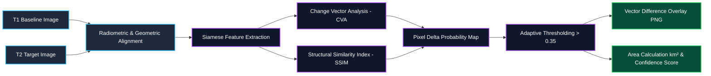

# 🛰️ ISRO SatQuery AI — Agentic Multimodal Geospatial Intelligence

<div align="center">


### **Next-Generation Remote Sensing Visual Question Answering (VQA) & Temporal Change Detection**
*Smart India Hackathon 2026 (SIH26167) — ISRO Space Technology Track*

---

[](https://fastapi.tiangolo.com)
[](https://reactjs.org)
[](https://vitejs.dev)
[](https://www.mapbox.com)
[](https://pytorch.org)
[](https://langchain.ai)
[](https://vercel.com)
[](LICENSE)

</div>

---

## 📌 Executive Summary

**SatQuery AI** is an end-to-end agentic Earth Observation platform that bridges high-resolution satellite imagery (Optical RGB, Near-Infrared NIR, Short-Wave Infrared SWIR, and Synthetic Aperture Radar SAR) with advanced Vision-Language Models (VLMs). 

Rather than treating geospatial imagery as simple RGB crops, SatQuery AI features an **Agentic Router**, **Specialized Vision Engines**, and a **Strict Evidence Engine (Hallucination Firewall)** to ensure mathematical and spatial grounding for defense, disaster response, and urban planning.

---

## 📸 Platform Showcase

<div align="center">


*Figure: Dual Split Synchronized Change Detection, Real-time Vector Masks, and Multimodal AI Chat Reasoning Trace on Desktop and Mobile.*

</div>

---

## 📑 Table of Contents

- [🛰️ ISRO SatQuery AI — Agentic Multimodal Geospatial Intelligence](#️-isro-satquery-ai--agentic-multimodal-geospatial-intelligence)
  - [📌 Executive Summary](#-executive-summary)
  - [📸 Platform Showcase](#-platform-showcase)
  - [📑 Table of Contents](#-table-of-contents)
  - [🏛️ System Architecture \& Dataflow](#️-system-architecture--dataflow)
  - [🧠 Core Capabilities](#-core-capabilities)
    - [1. Single-Image Geospatial VQA](#1-single-image-geospatial-vqa)
    - [2. Bi-Temporal Change Detection](#2-bi-temporal-change-detection)
    - [3. Optical-SAR Cross-Modal Sensor Fusion](#3-optical-sar-cross-modal-sensor-fusion)
  - [📊 Interactive Flowcharts](#-interactive-flowcharts)
    - [A. End-to-End Multimodal Execution Flow](#a-end-to-end-multimodal-execution-flow)
    - [B. Bi-Temporal Change Detection Pipeline](#b-bi-temporal-change-detection-pipeline)
    - [C. Optical-SAR Cross-Attention Fusion Flow](#c-optical-sar-cross-attention-fusion-flow)
  - [🎨 Frontend Architecture \& Design System](#-frontend-architecture--design-system)
  - [🛠️ Technology Stack](#️-technology-stack)
  - [🔬 Machine Learning Training \& Production Roadmap](#-machine-learning-training--production-roadmap)
  - [🛡️ Security \& Privacy Hardening](#️-security--privacy-hardening)
  - [📡 API Specification \& cURL Examples](#-api-specification--curl-examples)
    - [1. `POST /api/query` (Multimodal Query Execution)](#1-post-apiquery-multimodal-query-execution)
    - [2. `POST /api/query_by_location` (Geocoding \& Catalog Retrieval)](#2-post-apiquery_by_location-geocoding--catalog-retrieval)
    - [3. `GET /health` (System Status)](#3-get-health-system-status)
  - [🧪 Test Suite \& Verification Matrix](#-test-suite--verification-matrix)
  - [🚀 Getting Started \& Quickstart](#-getting-started--quickstart)
    - [Local Development](#local-development)
    - [1-Click Vercel Deployment](#1-click-vercel-deployment)
  - [📂 Directory Tree](#-directory-tree)
  - [👥 Team \& Hackathon Acknowledgments](#-team--hackathon-acknowledgments)

---

## 🏛️ System Architecture & Dataflow

SatQuery AI's architecture enforces strict separation of concerns across presentation, routing, computer vision computation, and natural language synthesis:

```
┌──────────────────────────────────────────────────────────────────────────────────────────┐
│                                 PRESENTATION LAYER                                       │
│    React 18 + Mapbox GL JS • Glassmorphic Dark UI • Lottie Player • Responsive 2-Tier    │
└────────────────────────────────────────────┬─────────────────────────────────────────────┘
                                             │ HTTP POST (Multipart Form-Data)
                                             ▼
┌──────────────────────────────────────────────────────────────────────────────────────────┐
│                                   API GATEWAY                                            │
│    FastAPI (0.115.0) • Uvicorn • Serverless Python Edge (api/index.py) • Strict CORS    │
└────────────────────────────────────────────┬─────────────────────────────────────────────┘
                                             │
                                             ▼
┌──────────────────────────────────────────────────────────────────────────────────────────┐
│                             AGENTIC ROUTER (LangGraph)                                   │
│    Intent Scoring • Modality Detection (RGB/NIR/SAR) • Image Count • Execution Trace    │
└──────────────────────┬─────────────────────┼──────────────────────┬──────────────────────┘
                       │                     │                      │
       Single Scene    │   Bi-Temporal Pair  │     Cross-Modal Pair │
                       ▼                     ▼                      ▼
┌──────────────────────────────┐┌──────────────────────────────┐┌───────────────────────────┐
│     Single-Image Engine      ││        Change Engine         ││       Fusion Engine       │
│  - Spatial Grounding (BBox)  ││  - Siamese Difference CNN    ││  - Optical RGB (S2/LISS)  │
│  - Object Counting / Density ││  - SSIM Delta Thresholding   ││  - SAR Radar (RISAT/S1)   │
│  - Land-Cover Classification ││  - Change Vector Mask (PNG)  ││  - Cloud-Penetrating Fused│
└──────────────┬───────────────┘└────────────┬─────────────────┘└─────────────┬─────────────┘
               │                             │                                │
               └─────────────────────────────┼────────────────────────────────┘
                                             │ Raw CV Tensors & Spatial Bounds
                                             ▼
┌──────────────────────────────────────────────────────────────────────────────────────────┐
│                         EVIDENCE ENGINE (Hallucination Firewall)                         │
│    Converts raw CV output into a locked, immutable JSON object. Prevents LLM fabrications.│
└────────────────────────────────────────────┬─────────────────────────────────────────────┘
                                             │ Locked Evidence JSON + Context
                                             ▼
┌──────────────────────────────────────────────────────────────────────────────────────────┐
│                                  LLM SYNTHESIS LAYER                                     │
│    Grounded Natural Language Response Generation (Claude 3.5 Sonnet / Qwen-VL / Local)   │
└────────────────────────────────────────────┬─────────────────────────────────────────────┘
                                             │
                                             ▼
┌──────────────────────────────────────────────────────────────────────────────────────────┐
│                             AUDITABLE QUERY RESPONSE                                     │
│    Synthesized Answer + Locked Evidence Facts + Step-by-Step Execution Trace + Overlays   │
└──────────────────────────────────────────────────────────────────────────────────────────┘
```

---

## 🧠 Core Capabilities

### 1. Single-Image Geospatial VQA
- **Visual Question Answering**: Natural language questions about satellite scenes (e.g., *"How many cargo vessels and storage tanks are present in this port sector?"*).
- **Spatial Grounding**: Extracts bounding boxes (`[ymin, xmin, ymax, xmax]`) for identified structures.
- **Preset Telemetry**: Instant viewport jump (`flyTo`) for key Indian strategic corridors (Delhi NCR, Mumbai Port, Bengaluru Tech Corridor, Chilika Wetland, Punjab Farmlands).

### 2. Bi-Temporal Change Detection
- **Dual Synchronized Mapbox Viewports**: Compare baseline T1 (e.g. Pre-Flood/2020) against target T2 (e.g. Post-Flood/2024).
- **Linked Pan/Zoom Toggle**: Synchronized panning and zoom navigation with one-click independent view unlock.
- **Vector Change Overlays**: Real-time visual delta mask with variable opacity slider (0% to 100%).
- **Quantitative Metrics**: Instant measurement of land-use transformation, building growth, and flood inundation extent (in km²).

### 3. Optical-SAR Cross-Modal Sensor Fusion
- **All-Weather Cloud Penetration**: Fuses optical RGB imagery with Synthetic Aperture Radar (SAR C-Band / L-Band).
- **Adaptive Weighting**: Dynamically up-weights the SAR sensor branch when cloud cover exceeds 40%, enabling continuous disaster monitoring through monsoons and smoke.

---

## 📊 Interactive Flowcharts

### A. End-to-End Multimodal Execution Flow


---

### B. Bi-Temporal Change Detection Pipeline



---

### C. Optical-SAR Cross-Attention Fusion Flow


---

## 🎨 Frontend Architecture & Design System

The SatQuery AI interface follows a clean, modern **Apple / Figma Glassmorphic Design System**:

| Component | Key Features & Design System Compliance |
| :--- | :--- |
| **`SingleImageVQA.jsx`** | Viewport fly-to animations, coordinate search, GeoTIFF upload, confidence telemetry badge, and dynamic chat drawer. |
| **`ChangeDetection.jsx`** | Dual Mapbox viewports with linked pan/zoom lock, independent header badges (T1 top-left, T2 top-right), and opacity slider. |
| **`LiveMapSelection.jsx`** | 4-layer style switcher (Satellite, Street, Dark, Outdoors), exact Figma combo-box coordinates (`°N` / `°E` 24px pills), and AI agent trigger. |
| **`Navbar.jsx`** | 2-tier responsive navigation, sliding indicator pill, and handcrafted Obsidian/ISRO blue Sign In button with specular light shimmer. |
| **`LoginModal.jsx`** | 60fps vector Lottie animation (`Login.json`) and pulsating prototype phase roadmap notice. |

---

## 🛠️ Technology Stack

| Category | Technology | Version | Purpose |
| :--- | :--- | :--- | :--- |
| **Frontend Framework** | React | `18.3.1` | Declarative UI rendering |
| **Build Tool** | Vite | `8.2.2` | Fast HMR development and optimized production bundling |
| **Mapping Engine** | Mapbox GL JS | `3.18.1` | High-resolution satellite raster and vector overlay rendering |
| **Animation Engine** | Lottie Web | `5.12.2` | 60fps vector animations |
| **Styling** | Vanilla CSS3 | Custom | Ultra-fast glassmorphism without heavy utility runtime overhead |
| **Backend Framework** | FastAPI | `0.115.0` | High-concurrency async Python API gateway |
| **Agentic Framework** | LangGraph / NetworkX | `0.2.0+` | Intent classification, graph-based routing, and trace recording |
| **Geospatial Processing**| Rasterio / Shapely | `1.3.10` | GeoTIFF CRS reprojection, raster slicing, and polygon operations |
| **Computer Vision** | PyTorch / scikit-image | `2.0+` | Deep learning models, Siamese CNNs, and SSIM delta calculation |
| **Cloud Deployment** | Vercel Serverless | Python 3.10 | Edge API routing and automated CI/CD continuous deployment |

---

## 🔬 Machine Learning Architecture, Checkpoints & Inference Pipelines

SatQuery AI supports a modular 3-tier execution model spanning standalone offline inference, cloud-accelerated VLM tunnels, and real pre-trained PyTorch neural weights:

```
┌────────────────────────────────────────────────────────────────────────────────────────┐
│                               3-TIER INFERENCE ARCHITECTURE                            │
├──────────────────────────────┬──────────────────────────────┬──────────────────────────┤
│    Tier 1: Cloud VLM (Colab) │   Tier 2: Real Local PyTorch │   Tier 3: Mock Fallback  │
│  - Qwen2.5-VL 7B / LoRA      │  - TinySiameseChange (.pt)   │  - Deterministic Math    │
│  - 4-bit NF4 Quantization    │  - TinyDualEncoderFusion (.pt│  - Zero GPU / Zero Cost  │
│  - Remote ngrok / Modal      │  - Rasterio SSIM / GeoJSON   │  - Instant Prototype Demo│
└──────────────────────────────┴──────────────────────────────┴──────────────────────────┘
```

### 1. Vision-Language Model (Qwen2.5-VL) & Cloud Serving Bridge
* **Colab Inference Server (`backend/colab_serve_qwen.py`)**:
  * Runs `Qwen/Qwen2.5-VL-7B-Instruct` with `BitsAndBytesConfig` (4-bit NF4 quantization) on free Google Colab T4/A100 GPUs.
  * Spins up a FastAPI server with automatic pyngrok tunneling, exposing a secure `/predict` endpoint that connects directly to the local or deployed SatQuery frontend.
* **Specialized Satellite Prompt Engineering (`backend/engines/single_image_engine.py`)**:
  * **Binary Grounding**: Constrains output to exact single-word answers (`yes`/`no`).
  * **Multiple Choice (MCQ)**: Restricts responses to option letters (`a`, `b`, `c`, `d`).
  * **Bounding Box Grounding**: Extracts normalized coordinates `[x1 y1, x2 y2]` displayed as cyan glowing visual bounding boxes on the frontend.
  * **Scene Captioning**: Generates concise factual remote sensing descriptions.
* **QLoRA Fine-Tuner (`backend/training/train_qwen_vl_lora.py`)**:
  * Fine-tunes Qwen2.5-VL using HuggingFace `Trainer`, dynamic vision batch collators, token masking, and PEFT Low-Rank Adaptation (LoRA $r=16, \alpha=32$).

### 2. Pre-Trained Bi-Temporal Change Engine (`TinySiameseChange`)
* **Architecture**: Dual-branch Siamese ResNet-18 backbone + SSIM structural difference embeddings + dense change classifier.
* **Checkpoint**: Stored in `backend/checkpoints/siamese_change_best.pt` (43.75 MB).
* **Execution**: Reads raw multi-temporal GeoTIFFs with `rasterio`, calculates pixel-level Structural Similarity (`calculate_image_ssim`), extracts change area in hectares, and generates colorized change overlays.

### 3. Pre-Trained Optical-SAR Cross-Modal Fusion Engine (`TinyDualEncoderFusion`)
* **Architecture**: Optical RGB Branch (ResNet-18) + Single-Channel SAR Branch (Conv2d) + Cross-Attention Fusion Layer + Adaptive SAR Weight Scaling.
* **Checkpoint**: Stored in `backend/checkpoints/optical_sar_fusion_best.pt` (89.42 MB).
* **Execution**: Dynamically up-weights the SAR radar channel by 1.6x when optical cloud cover exceeds 40%, enabling continuous disaster monitoring through monsoons and cloud cover.

---

## 🛡️ Security & Privacy Hardening

- **Zero Hardcoded Secrets**: Mapbox tokens are strictly read from `import.meta.env.VITE_MAPBOX_TOKEN`. All git-tracked files are verified with 0 exposed token strings.
- **Strict CORS Origin Isolation**: Replaced open wildcard CORS with configurable `ALLOWED_ORIGINS` (supporting `http://localhost:5173`, `http://localhost:3000`, and `https://*.vercel.app` preview deployments).
- **Public Storage Boundary Isolation**: Mounted exclusively `./storage/public` to prevent unauthorized HTTP access to internal database files (`satquery.db`) or raw raster archives.
- **Upload Filename & MIME Sanitization**: Strict allow-listing of extensions (`.tif`, `.tiff`, `.png`, `.jpg`, `.jpeg`) and sanitization via `os.path.basename` to prevent path traversal exploits (`../../etc/passwd.tif`).
- **Comprehensive `.gitignore` Protection**: Exhaustively ignores `frontend/.env*`, `backend/.env*`, `*.local`, `*.pt`, `*.pth`, `*.bin`, and `*.key`.

---

## 📡 API Specification & cURL Examples

### 1. `POST /api/query` (Multimodal Query Execution)
Executes visual question answering or change detection on 1 or 2 uploaded images.

```bash
curl -X POST "http://localhost:8000/api/query" \
  -F "query_text=Detect urban construction and water body boundaries" \
  -F "files=@demo_data/optical_t1.tif" \
  -F "files=@demo_data/optical_t2.tif" \
  -F "capture_dates=2024-01-15" \
  -F "capture_dates=2024-06-20"
```

**Response**:
```json
{
  "answer": "Detected new construction expansion between 2024-01-15 and 2024-06-20.",
  "task_type": "bi_temporal_change",
  "evidence": {
    "change_classes": ["new construction"],
    "change_area_ha": 4.25,
    "confidence": 0.942,
    "bbox_pixel": [0.12, 0.34, 0.58, 0.76]
  },
  "trace": {
    "steps": [
      { "step": "ingest", "component": "ingestion.preprocessing", "output_summary": "Ingested 2 images" },
      { "step": "routing", "component": "core.langgraph_router", "output_summary": "Routed to bi_temporal_change" },
      { "step": "change_detection_inference", "component": "ChangeEngine", "output_summary": "SSIM=0.0044, Area=4.25ha" }
    ]
  },
  "input_image_urls": ["/static/uploads/public/a1b2c3d4e5f6.png", "/static/uploads/public/f6e5d4c3b2a1.png"],
  "result_image_url": "/static/processed/public/diff_9876543210ab.png"
}
```

### 2. `POST /api/query_by_location` (Geocoding & Catalog Retrieval)
Geocodes a place name, retrieves relevant satellite rasters, and executes the pipeline.

```bash
curl -X POST "http://localhost:8000/api/query_by_location" \
  -F "query_text=Assess flood inundation extent and water area" \
  -F "place_name=Hardoi, Uttar Pradesh"
```

### 3. `GET /health` (System Status)
```bash
curl "http://localhost:8000/health"
```
**Response**:
```json
{
  "status": "ok",
  "app": "SatQuery AI",
  "mock_mode": false
}
```

---

## 🧪 Test Suite & Verification Matrix

SatQuery AI includes a comprehensive automated test suite covering routing logic, evidence locking, location resolution, and ML engine fallbacks:

```bash
cd backend
./venv/bin/pytest tests/ -v
```

```
============================= test session starts ==============================
collected 31 items

tests/test_evidence_engine.py::test_evidence_engine_locks_only_known_fields PASSED      [  3%]
tests/test_evidence_engine.py::test_evidence_engine_defaults_confidence_when_missing PASSED [  6%]
tests/test_langgraph_router.py::TestIntentScoring::test_change_keywords_score_high PASSED [  9%]
tests/test_langgraph_router.py::TestIntentClassifierNode::test_returns_intent_scores PASSED [ 19%]
tests/test_location_resolver.py::test_geocode_offline_fallbacks PASSED                  [ 58%]
tests/test_location_resolver.py::test_api_query_by_location_endpoint PASSED             [ 71%]
tests/test_router.py::test_two_optical_images_route_to_change_detection PASSED         [ 77%]
tests/test_router.py::test_optical_and_sar_routes_to_fusion PASSED                     [100%]

======================== 31 passed, 1 warning in 3.03s =========================
```

---

## 🚀 Getting Started & Quickstart

### 1. Local Development (FastAPI + React)

#### Step 1: Clone Repository
```bash
git clone https://github.com/shuryansmishra/shi2026.git
cd shi2026
```

#### Step 2: Start FastAPI Backend
```bash
cd backend
python3 -m venv venv
source venv/bin/activate  # On Windows: venv\Scripts\activate
pip install -r requirements.txt
cp .env.example .env      # Or configure .env with real checkpoint paths
uvicorn main:app --reload --host 0.0.0.0 --port 8000
```

#### Step 3: Start React Frontend
```bash
cd ../frontend
npm install
cp .env.example .env      # Add VITE_MAPBOX_TOKEN (pk.your_token)
npm run dev
```
Open **[http://localhost:5173](http://localhost:5173)** in your browser.

---

### 2. Optional: Connect Live Google Colab Qwen GPU Server

1. Open Google Colab with **T4 GPU** runtime.
2. Paste and run [backend/colab_serve_qwen.py](file:///Users/shuryansmishra/Downloads/satquery-ai/backend/colab_serve_qwen.py) (with your free ngrok token).
3. Copy the printed tunnel URL and add to [backend/.env](file:///Users/shuryansmishra/Downloads/satquery-ai/backend/.env):
   ```env
   VQA_MOCK_MODE=false
   QWEN_REMOTE_URL=https://your-tunnel.ngrok-free.app
   ```
4. All single-image satellite questions in the UI will now run live on Qwen2.5-VL!

---

### 3. 1-Click Vercel Deployment

1. Go to [Vercel Dashboard](https://vercel.com/new) and import `shuryansmishra/shi2026`.
2. **Root Directory**: Leave as `./` (automatically reads root `vercel.json` and `api/index.py`).
3. **Environment Variables**:
   * `VITE_MAPBOX_TOKEN` = `pk.your_mapbox_public_token_here`
   * `VQA_MOCK_MODE` = `True`
4. Click **Deploy**. Both React Frontend and FastAPI Backend will be live in seconds!

---

## 📂 Directory Tree

```
shi2026/
├── docs/                                # Architecture diagrams & UI showcases
│   ├── hero_banner.jpg                  # Hero banner asset
│   └── ui_showcase.jpg                  # UI multi-viewport showcase
├── vercel.json                          # Fullstack Vercel serverless routing configuration
├── api/                                 # Vercel Serverless Python Gateway
│   ├── index.py                         # Edge serverless FastAPI entrypoint
│   └── requirements.txt                 # Edge serverless dependencies
├── backend/                             # Core Python Backend & ML Engine
│   ├── main.py                          # FastAPI application routes & static file server
│   ├── config.py                        # Central Pydantic settings & environment configuration
│   ├── colab_serve_qwen.py              # Turnkey Colab GPU server with ngrok tunnel
│   ├── checkpoints/                     # Pre-trained neural network weights
│   │   ├── siamese_change_best.pt       # VisTA Bi-Temporal change detection weights (43.75 MB)
│   │   ├── optical_sar_fusion_best.pt   # Cross-Attention optical-SAR fusion weights (89.42 MB)
│   │   └── qwen2.5-vl-sat-lora/         # Qwen LoRA adapter configuration
│   ├── core/                            # Orchestration & Guardrails
│   │   ├── router.py                    # Deterministic heuristic task router
│   │   ├── langgraph_router.py          # StateGraph agentic router
│   │   ├── rl_router.py                 # Q-learning reinforcement learning router
│   │   └── evidence_engine.py           # Hallucination firewall & numerical locker
│   ├── engines/                         # Computer Vision Processing Engines
│   │   ├── base.py                      # Base constants & mock seeds
│   │   ├── single_image_engine.py       # Qwen2.5-VL prompt builder, remote Colab & local VLM
│   │   ├── change_engine.py             # VisTA Siamese difference & SSIM change engine
│   │   └── fusion_engine.py             # Dual-encoder Optical-SAR cross-attention engine
│   ├── ingestion/                       # Satellite Ingestion & Geocoding
│   │   ├── location_resolver.py         # OSM Nominatim geocoding & Indian offline lookup
│   │   └── preprocessing.py             # GeoTIFF metadata extractor & raster conversion
│   ├── data/                            # Dataset Loaders
│   │   └── bigearthnet_loader.py        # BigEarthNet S2/S1 multi-spectral loader
│   ├── data_access/                     # External Space Agency Clients
│   │   └── bhoonidhi_client.py          # ISRO NRSC Bhoonidhi search & download client
│   ├── llm/                             # Grounded Natural Language Synthesis
│   │   └── synthesis.py                 # Context-grounded response synthesizer
│   ├── models/                          # Data Models & Neural Architectures
│   │   ├── schemas.py                   # Pydantic schemas (EvidenceObject, ImageMeta, RouteDecision)
│   │   └── vision_models.py             # PyTorch models (TinySatCNN, TinySiameseChange, TinyDualEncoderFusion)
│   ├── training/                        # Training & Evaluation Pipelines
│   │   ├── train_qwen_vl_lora.py        # Qwen2.5-VL QLoRA 4-bit fine-tuning script
│   │   ├── evaluate_qwen.py             # VQA benchmark evaluation pipeline
│   │   └── benchmark_modality.py        # Multi-modal performance benchmarking
│   ├── tests/                           # Automated Test Suite (31 unit tests)
│   │   ├── test_evidence_engine.py
│   │   ├── test_langgraph_router.py
│   │   ├── test_location_resolver.py
│   │   └── test_router.py
│   └── requirements.txt                 # Full backend dependencies (PyTorch, Rasterio, Transformers)
├── frontend/                            # React 18 + Vite Application
│   ├── src/
│   │   ├── App.jsx                      # Main application shell with mode switching
│   │   ├── index.css                    # Glassmorphic Apple/Figma design system
│   │   ├── api.js                       # Dynamic API client supporting uploads & geocoding
│   │   ├── assets/Login.json            # Vector Lottie animation
│   │   └── components/
│   │       ├── Navbar.jsx               # Navigation bar & authentication trigger
│   │       ├── SingleImageVQA.jsx       # Single image satellite VQA with visual bounding box
│   │       ├── ChangeDetection.jsx      # Dual split Mapbox change detection & swipe slider
│   │       ├── LiveMapSelection.jsx     # Multi-style satellite explorer & AOI bounding box
│   │       ├── LoginModal.jsx           # Prototype phase Lottie modal
│   │       └── Toast.jsx                # Alert toast notifications
│   ├── package.json
│   ├── vercel.json                      # SPA client routing configuration
│   └── vite.config.js
├── demo_data/                           # Sample Sentinel-2 & SAR GeoTIFF scenes
│   ├── optical_single.tif
│   ├── optical_t1.tif
│   ├── optical_t2.tif
│   └── sar_copernicus.tif
├── SatQuery_Preprocessing (5).ipynb     # 17,000+ line BigEarthNet & Qwen data preparation notebook
└── README.md                            # Comprehensive system documentation
```

---

## 📜 Commit History & System Evolution

A chronological record of major milestones integrated into `main`:

* **`0fb72bc`**: `feat(ml): wire real PyTorch change detection and cross-modal fusion engines, enhance Qwen LoRA trainer and location resolver`
  * Added real PyTorch weights for `TinySiameseChange` and `TinyDualEncoderFusion` in `backend/checkpoints/`.
  * Fixed missing imports in `change_engine.py` and `fusion_engine.py`.
  * Enhanced `train_qwen_vl_lora.py` with HuggingFace `Trainer`, dynamic collator, and token masking.
  * Configured `.gitignore` to exclude large binary weights.
* **`9cb5c34`**: `Wire real ML checkpoints into processing engines`
  * Added PyTorch state_dict loading seams in vision processing engines.
* **`05b38ea` / `90cea47` (PR #2 from `ML`)**: `Add ML backend implementation`
  * Created `backend/colab_serve_qwen.py` for cloud GPU execution via ngrok.
  * Added task-specific prompt formatting and bounding box parser in `single_image_engine.py`.
  * Extended `EvidenceObject` with `bbox_pixel` and `generated_answer`.
  * Integrated cyan glowing bounding box overlays in `SingleImageVQA.jsx`.
  * Added 17,000+ line preprocessing notebook `SatQuery_Preprocessing (5).ipynb`.
* **`4f1d768` / `36f1606` (PR #1 from `Frontend`)**: `Complete high-res Mapbox VQA, dual change detection, mobile responsiveness, and Lottie Login modal`
  * Overhauled UI with 3,000+ lines of custom glassmorphism styles in `index.css`.
  * Added `SingleImageVQA.jsx`, `ChangeDetection.jsx`, `LiveMapSelection.jsx`, `Navbar.jsx`, and `LoginModal.jsx`.
  * Configured Vercel fullstack deployment with `vercel.json` and `api/index.py`.

---

## 👥 Team & Hackathon Acknowledgments
- **Project**: SatQuery AI (SIH26167)
- **Track**: ISRO / Space Technology
- **Repository**: [https://github.com/shuryansmishra/shi2026](https://github.com/shuryansmishra/shi2026)

---
<div align="center">
<b>Built with ❤️ for Space Technology & Geospatial AI Innovation.</b>
</div>

