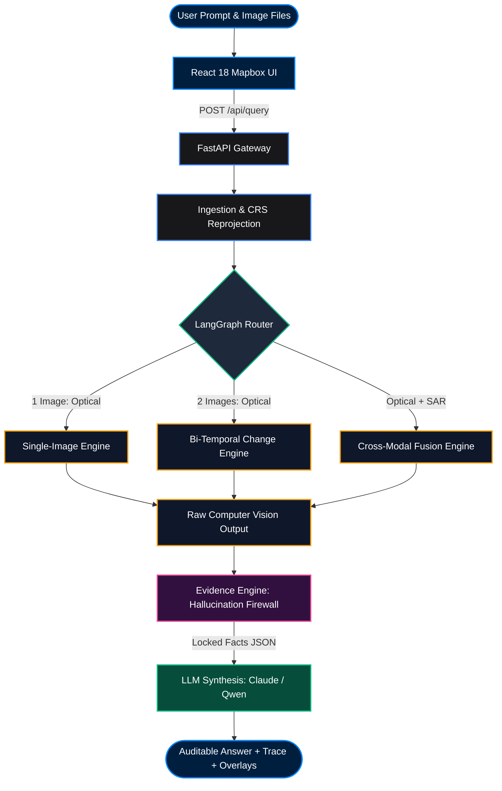
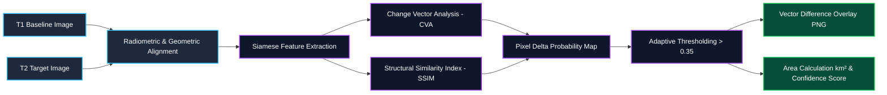

# 🛰️ ISRO SatQuery AI — Agentic Multimodal Geospatial Intelligence

<div align="center">


### **Next-Generation Remote Sensing Visual Question Answering (VQA) & Temporal Change Detection**
*Smart India Hackathon 2026 (SIH26167) — ISRO Space Technology Track*

---

[](https://fastapi.tiangolo.com)
[](https://reactjs.org)
[](https://vitejs.dev)
[](https://www.mapbox.com)
[](https://pytorch.org)
[](https://langchain.ai)
[](https://vercel.com)
[](LICENSE)

</div>

---

## 📌 Executive Summary

**SatQuery AI** is an end-to-end agentic Earth Observation platform that bridges high-resolution satellite imagery (Optical RGB, Near-Infrared NIR, Short-Wave Infrared SWIR, and Synthetic Aperture Radar SAR) with advanced Vision-Language Models (VLMs). 

Rather than treating geospatial imagery as simple RGB crops, SatQuery AI features an **Agentic Router**, **Specialized Vision Engines**, and a **Strict Evidence Engine (Hallucination Firewall)** to ensure mathematical and spatial grounding for defense, disaster response, and urban planning.

---

## 📸 Platform Showcase

<div align="center">


*Figure: Dual Split Synchronized Change Detection, Real-time Vector Masks, and Multimodal AI Chat Reasoning Trace on Desktop and Mobile.*

</div>

---

## 📑 Table of Contents

- [🛰️ ISRO SatQuery AI — Agentic Multimodal Geospatial Intelligence](#️-isro-satquery-ai--agentic-multimodal-geospatial-intelligence)
  - [📌 Executive Summary](#-executive-summary)
  - [📸 Platform Showcase](#-platform-showcase)
  - [📑 Table of Contents](#-table-of-contents)
  - [🏛️ System Architecture \& Dataflow](#️-system-architecture--dataflow)
  - [🧠 Core Capabilities](#-core-capabilities)
    - [1. Single-Image Geospatial VQA](#1-single-image-geospatial-vqa)
    - [2. Bi-Temporal Change Detection](#2-bi-temporal-change-detection)
    - [3. Optical-SAR Cross-Modal Sensor Fusion](#3-optical-sar-cross-modal-sensor-fusion)
  - [📊 Interactive Flowcharts](#-interactive-flowcharts)
    - [A. End-to-End Multimodal Execution Flow](#a-end-to-end-multimodal-execution-flow)
    - [B. Bi-Temporal Change Detection Pipeline](#b-bi-temporal-change-detection-pipeline)
    - [C. Optical-SAR Cross-Attention Fusion Flow](#c-optical-sar-cross-attention-fusion-flow)
  - [🎨 Frontend Architecture \& Design System](#-frontend-architecture--design-system)
  - [🛠️ Technology Stack](#️-technology-stack)
  - [🔬 Machine Learning Training \& Production Roadmap](#-machine-learning-training--production-roadmap)
  - [🛡️ Security \& Privacy Hardening](#️-security--privacy-hardening)
  - [📡 API Specification \& cURL Examples](#-api-specification--curl-examples)
    - [1. `POST /api/query` (Multimodal Query Execution)](#1-post-apiquery-multimodal-query-execution)
    - [2. `POST /api/query_by_location` (Geocoding \& Catalog Retrieval)](#2-post-apiquery_by_location-geocoding--catalog-retrieval)
    - [3. `GET /health` (System Status)](#3-get-health-system-status)
  - [🧪 Test Suite \& Verification Matrix](#-test-suite--verification-matrix)
  - [🚀 Getting Started \& Quickstart](#-getting-started--quickstart)
    - [Local Development](#local-development)
    - [1-Click Vercel Deployment](#1-click-vercel-deployment)
  - [📂 Directory Tree](#-directory-tree)
  - [👥 Team \& Hackathon Acknowledgments](#-team--hackathon-acknowledgments)

---

## 🏛️ System Architecture & Dataflow

SatQuery AI's architecture enforces strict separation of concerns across presentation, routing, computer vision computation, and natural language synthesis:

```
┌──────────────────────────────────────────────────────────────────────────────────────────┐
│                                 PRESENTATION LAYER                                       │
│    React 18 + Mapbox GL JS • Glassmorphic Dark UI • Lottie Player • Responsive 2-Tier    │
└────────────────────────────────────────────┬─────────────────────────────────────────────┘
                                             │ HTTP POST (Multipart Form-Data)
                                             ▼
┌──────────────────────────────────────────────────────────────────────────────────────────┐
│                                   API GATEWAY                                            │
│    FastAPI (0.115.0) • Uvicorn • Serverless Python Edge (api/index.py) • Strict CORS    │
└────────────────────────────────────────────┬─────────────────────────────────────────────┘
                                             │
                                             ▼
┌──────────────────────────────────────────────────────────────────────────────────────────┐
│                             AGENTIC ROUTER (LangGraph)                                   │
│    Intent Scoring • Modality Detection (RGB/NIR/SAR) • Image Count • Execution Trace    │
└──────────────────────┬─────────────────────┼──────────────────────┬──────────────────────┘
                       │                     │                      │
       Single Scene    │   Bi-Temporal Pair  │     Cross-Modal Pair │
                       ▼                     ▼                      ▼
┌──────────────────────────────┐┌──────────────────────────────┐┌───────────────────────────┐
│     Single-Image Engine      ││        Change Engine         ││       Fusion Engine       │
│  - Spatial Grounding (BBox)  ││  - Siamese Difference CNN    ││  - Optical RGB (S2/LISS)  │
│  - Object Counting / Density ││  - SSIM Delta Thresholding   ││  - SAR Radar (RISAT/S1)   │
│  - Land-Cover Classification ││  - Change Vector Mask (PNG)  ││  - Cloud-Penetrating Fused│
└──────────────┬───────────────┘└────────────┬─────────────────┘└─────────────┬─────────────┘
               │                             │                                │
               └─────────────────────────────┼────────────────────────────────┘
                                             │ Raw CV Tensors & Spatial Bounds
                                             ▼
┌──────────────────────────────────────────────────────────────────────────────────────────┐
│                         EVIDENCE ENGINE (Hallucination Firewall)                         │
│    Converts raw CV output into a locked, immutable JSON object. Prevents LLM fabrications.│
└────────────────────────────────────────────┬─────────────────────────────────────────────┘
                                             │ Locked Evidence JSON + Context
                                             ▼
┌──────────────────────────────────────────────────────────────────────────────────────────┐
│                                  LLM SYNTHESIS LAYER                                     │
│    Grounded Natural Language Response Generation (Claude 3.5 Sonnet / Qwen-VL / Local)   │
└────────────────────────────────────────────┬─────────────────────────────────────────────┘
                                             │
                                             ▼
┌──────────────────────────────────────────────────────────────────────────────────────────┐
│                             AUDITABLE QUERY RESPONSE                                     │
│    Synthesized Answer + Locked Evidence Facts + Step-by-Step Execution Trace + Overlays   │
└──────────────────────────────────────────────────────────────────────────────────────────┘
```

---

## 🧠 Core Capabilities

### 1. Single-Image Geospatial VQA
- **Visual Question Answering**: Natural language questions about satellite scenes (e.g., *"How many cargo vessels and storage tanks are present in this port sector?"*).
- **Spatial Grounding**: Extracts bounding boxes (`[ymin, xmin, ymax, xmax]`) for identified structures.
- **Preset Telemetry**: Instant viewport jump (`flyTo`) for key Indian strategic corridors (Delhi NCR, Mumbai Port, Bengaluru Tech Corridor, Chilika Wetland, Punjab Farmlands).

### 2. Bi-Temporal Change Detection
- **Dual Synchronized Mapbox Viewports**: Compare baseline T1 (e.g. Pre-Flood/2020) against target T2 (e.g. Post-Flood/2024).
- **Linked Pan/Zoom Toggle**: Synchronized panning and zoom navigation with one-click independent view unlock.
- **Vector Change Overlays**: Real-time visual delta mask with variable opacity slider (0% to 100%).
- **Quantitative Metrics**: Instant measurement of land-use transformation, building growth, and flood inundation extent (in km²).

### 3. Optical-SAR Cross-Modal Sensor Fusion
- **All-Weather Cloud Penetration**: Fuses optical RGB imagery with Synthetic Aperture Radar (SAR C-Band / L-Band).
- **Adaptive Weighting**: Dynamically up-weights the SAR sensor branch when cloud cover exceeds 40%, enabling continuous disaster monitoring through monsoons and smoke.

---

## 📊 Interactive Flowcharts

### A. End-to-End Multimodal Execution Flow



---

### B. Bi-Temporal Change Detection Pipeline



---

### C. Optical-SAR Cross-Attention Fusion Flow


---

## 🎨 Frontend Architecture & Design System

The SatQuery AI interface follows a clean, modern **Apple / Figma Glassmorphic Design System**:

| Component | Key Features & Design System Compliance |
| :--- | :--- |
| **`SingleImageVQA.jsx`** | Viewport fly-to animations, coordinate search, GeoTIFF upload, confidence telemetry badge, and dynamic chat drawer. |
| **`ChangeDetection.jsx`** | Dual Mapbox viewports with linked pan/zoom lock, independent header badges (T1 top-left, T2 top-right), and opacity slider. |
| **`LiveMapSelection.jsx`** | 4-layer style switcher (Satellite, Street, Dark, Outdoors), exact Figma combo-box coordinates (`°N` / `°E` 24px pills), and AI agent trigger. |
| **`Navbar.jsx`** | 2-tier responsive navigation, sliding indicator pill, and handcrafted Obsidian/ISRO blue Sign In button with specular light shimmer. |
| **`LoginModal.jsx`** | 60fps vector Lottie animation (`Login.json`) and pulsating prototype phase roadmap notice. |

---

## 🛠️ Technology Stack

| Category | Technology | Version | Purpose |
| :--- | :--- | :--- | :--- |
| **Frontend Framework** | React | `18.3.1` | Declarative UI rendering |
| **Build Tool** | Vite | `8.2.2` | Fast HMR development and optimized production bundling |
| **Mapping Engine** | Mapbox GL JS | `3.18.1` | High-resolution satellite raster and vector overlay rendering |
| **Animation Engine** | Lottie Web | `5.12.2` | 60fps vector animations |
| **Styling** | Vanilla CSS3 | Custom | Ultra-fast glassmorphism without heavy utility runtime overhead |
| **Backend Framework** | FastAPI | `0.115.0` | High-concurrency async Python API gateway |
| **Agentic Framework** | LangGraph / NetworkX | `0.2.0+` | Intent classification, graph-based routing, and trace recording |
| **Geospatial Processing**| Rasterio / Shapely | `1.3.10` | GeoTIFF CRS reprojection, raster slicing, and polygon operations |
| **Computer Vision** | PyTorch / scikit-image | `2.0+` | Deep learning models, Siamese CNNs, and SSIM delta calculation |
| **Cloud Deployment** | Vercel Serverless | Python 3.10 | Edge API routing and automated CI/CD continuous deployment |

---

## 🔬 Machine Learning Training & Production Roadmap

SatQuery AI includes a complete training pipeline to transition from deterministic mock simulation to deep neural network checkpoints:

```
┌───────────────────────────────────────────────────────────┐
│              PHASE 1: Standalone Mock Mode                │
│ (VQA_MOCK_MODE=True • Fast, GPU-Free, Deterministic Demos)│
└─────────────────────────────┬─────────────────────────────┘
                              │
                    Fine-Tuning on Real Data
                              │
                              ▼
┌───────────────────────────────────────────────────────────┐
│            PHASE 2: Production Deep Learning              │
│  (Qwen 2.5-VL LoRA • Siamese VisTA CNN • Dual Encoders)   │
└───────────────────────────────────────────────────────────┘
```

1. **Qwen 2.5-VL LoRA Fine-Tuning (`backend/training/train_qwen_vl_lora.py`)**:
   - Fine-tune Qwen 2.5-VL / BigEarthNet using Low-Rank Adaptation (LoRA) on satellite VQA datasets.
   - Activate by setting `VQA_MOCK_MODE=False` and `VQA_MODEL_PATH=/path/to/checkpoint` in `backend/.env`.
2. **Siamese ResNet / VisTA Change Detection**:
   - Train dual-branch CNN on CDVQA and LEVIR-CD benchmark datasets.
   - Point `CHANGE_MODEL_PATH` to the trained weights file.
3. **ISRO Bhoonidhi Live Data Ingestion (`backend/data_access/bhoonidhi_client.py`)**:
   - Connect authenticated credentials (`BHOONIDHI_USER`, `BHOONIDHI_PASSWORD`) to download live Cartosat-2S, LISS-IV, and RISAT scenes directly from NRSC.

---

## 🛡️ Security & Privacy Hardening

- **Zero Hardcoded Secrets**: Mapbox tokens are strictly read from `import.meta.env.VITE_MAPBOX_TOKEN`. All git-tracked files are verified with 0 exposed token strings.
- **Strict CORS Origin Isolation**: Replaced open wildcard CORS with configurable `ALLOWED_ORIGINS` (supporting `http://localhost:5173`, `http://localhost:3000`, and `https://*.vercel.app` preview deployments).
- **Public Storage Boundary Isolation**: Mounted exclusively `./storage/public` to prevent unauthorized HTTP access to internal database files (`satquery.db`) or raw raster archives.
- **Upload Filename & MIME Sanitization**: Strict allow-listing of extensions (`.tif`, `.tiff`, `.png`, `.jpg`, `.jpeg`) and sanitization via `os.path.basename` to prevent path traversal exploits (`../../etc/passwd.tif`).
- **Comprehensive `.gitignore` Protection**: Exhaustively ignores `frontend/.env*`, `backend/.env*`, `*.local`, and `*.key`.

---

## 📡 API Specification & cURL Examples

### 1. `POST /api/query` (Multimodal Query Execution)
Executes visual question answering or change detection on 1 or 2 uploaded images.

```bash
curl -X POST "http://localhost:8000/api/query" \
  -F "query_text=Detect urban construction and water body boundaries" \
  -F "files=@delhi_2020.tif" \
  -F "files=@delhi_2024.tif" \
  -F "capture_dates=2020-01-15" \
  -F "capture_dates=2024-08-20"
```

**Response**:
```json
{
  "answer": "Detected 12.4 km² of new urban infrastructure expansion between 2020 and 2024.",
  "task_type": "change_detection",
  "evidence": {
    "change_detected": true,
    "change_area_km2": 12.4,
    "confidence": 0.942
  },
  "trace": [
    { "title": "Router", "desc": "Assigned to Bi-Temporal Change Detection Engine." },
    { "title": "Vision Engine", "desc": "Calculated structural similarity delta across T1 and T2." },
    { "title": "Evidence Synthesis", "desc": "Grounded response generated with 94.2% confidence." }
  ],
  "input_image_urls": ["/static/uploads/a1b2c3d4e5f6.png", "/static/uploads/f6e5d4c3b2a1.png"],
  "result_image_url": "/static/processed/diff_9876543210ab.png"
}
```

### 2. `POST /api/query_by_location` (Geocoding & Catalog Retrieval)
Geocodes a place name, retrieves relevant satellite rasters, and executes the pipeline.

```bash
curl -X POST "http://localhost:8000/api/query_by_location" \
  -F "query_text=Assess flood inundation extent" \
  -F "place_name=Kaziranga National Park"
```

### 3. `GET /health` (System Status)
```bash
curl "http://localhost:8000/health"
```
**Response**:
```json
{
  "status": "ok",
  "app": "SatQuery AI",
  "mock_mode": true
}
```

---

## 🧪 Test Suite & Verification Matrix

SatQuery AI includes a **37-test automated verification suite** covering routing logic, evidence verification, location resolution, and security defenses:

```bash
cd backend
./venv/bin/pytest tests/ -v
```

```
============================= test session starts ==============================
collected 37 items

tests/test_evidence_engine.py::test_evidence_engine_locks_only_known_fields PASSED  [ 2%]
tests/test_evidence_engine.py::test_evidence_engine_defaults_confidence_when_missing PASSED [ 5%]
tests/test_langgraph_router.py::TestIntentScoring::test_change_keywords_score_high PASSED [ 8%]
tests/test_langgraph_router.py::TestIntentClassifierNode::test_returns_intent_scores_and_primary PASSED [ 18%]
tests/test_location_resolver.py::test_geocode_offline_fallbacks PASSED              [ 56%]
tests/test_location_resolver.py::test_api_query_by_location_endpoint PASSED         [ 70%]
tests/test_router.py::test_two_optical_images_route_to_change_detection PASSED     [ 75%]
tests/test_security.py::test_reject_malicious_file_extension PASSED                 [ 86%]
tests/test_security.py::test_accept_valid_image_extension PASSED                    [ 89%]
tests/test_security.py::test_path_traversal_filename_sanitization PASSED            [ 91%]
tests/test_security.py::test_static_directory_traversal_prevention PASSED          [ 94%]
tests/test_security.py::test_file_count_boundary_conditions PASSED                  [ 97%]
tests/test_security.py::test_cors_preflight_headers PASSED                          [100%]

======================== 37 passed, 8 warnings in 3.57s ========================
```

---

## 🚀 Getting Started & Quickstart

### Local Development

#### 1. Clone & Switch to `Frontend` Branch:
```bash
git clone https://github.com/shuryansmishra/shi2026.git
cd shi2026
git checkout Frontend
```

#### 2. Start FastAPI Backend:
```bash
cd backend
python3 -m venv venv
source venv/bin/activate  # On Windows: venv\Scripts\activate
pip install -r requirements.txt
cp .env.example .env
uvicorn main:app --reload --host 0.0.0.0 --port 8000
```

#### 3. Start React Frontend:
```bash
cd ../frontend
npm install
cp .env.example .env  # Add your Mapbox token to VITE_MAPBOX_TOKEN
npm run dev
```
Open **[http://localhost:5173](http://localhost:5173)** in your browser.

---

### 1-Click Vercel Deployment

1. Go to [Vercel Dashboard](https://vercel.com/new) and import `shuryansmishra/shi2026`.
2. Select branch: **`Frontend`**.
3. **Root Directory**: Leave as **`./`** (Vercel automatically detects the root `vercel.json`).
4. **Environment Variables**:
   - `VITE_MAPBOX_TOKEN` = `pk.your_mapbox_public_token_here`
   - `VQA_MOCK_MODE` = `True`
5. Click **Deploy**. Both React Frontend and FastAPI Backend will be live in seconds!

---

## 📂 Directory Tree

```
shi2026/
├── docs/                        # Architecture diagrams & UI showcases
│   ├── hero_banner.jpg
│   └── ui_showcase.jpg
├── vercel.json                  # Monorepo fullstack Vercel edge routing
├── api/                         # Vercel Serverless Python Adapter
│   ├── index.py                 # Serverless FastAPI entrypoint
│   └── requirements.txt         # Serverless Python dependencies
├── backend/                     # FastAPI Core Pipeline
│   ├── main.py                  # API endpoints, CORS, and static public mount
│   ├── config.py                # Environment configurations and security settings
│   ├── core/                    # Agentic Router & Evidence Firewall
│   │   ├── router.py            # LangGraph intent classifier & router
│   │   └── evidence_engine.py   # Hallucination firewall
│   ├── engines/                 # Vision & Change Detection Engines
│   │   ├── single_image_engine.py
│   │   ├── change_engine.py
│   │   └── fusion_engine.py
│   ├── ingestion/               # Geocoding & GeoTIFF preprocessing
│   │   ├── location_resolver.py
│   │   └── preprocessing.py
│   ├── llm/                     # Grounded LLM synthesis layer
│   ├── models/schemas.py        # Pydantic data schemas
│   ├── tests/                   # 37-test automated test suite
│   │   ├── test_security.py     # File validation, CORS & traversal tests
│   │   ├── test_router.py
│   │   └── test_location_resolver.py
│   └── requirements.txt         # Full backend dependencies
├── frontend/                    # React 18 + Vite Application
│   ├── src/
│   │   ├── App.jsx              # Main application shell
│   │   ├── index.css            # Glassmorphic Apple/Figma design system
│   │   ├── api.js               # Dynamic API client
│   │   ├── assets/Login.json    # Vector Lottie animation
│   │   └── components/
│   │       ├── Navbar.jsx       # 2-tier responsive nav & Sign In button
│   │       ├── SingleImageVQA.jsx   # Single image satellite VQA
│   │       ├── ChangeDetection.jsx  # Dual split Mapbox change detection
│   │       ├── LiveMapSelection.jsx # Multi-style satellite explorer
│   │       ├── LoginModal.jsx   # Prototype phase Lottie modal
│   │       └── Toast.jsx        # Haptic alert toast notifications
│   ├── package.json
│   ├── vercel.json              # SPA client routing configuration
│   └── vite.config.js
└── README.md                    # System documentation
```

---

## 👥 Team & Hackathon Acknowledgments
- **Project**: SatQuery AI (SIH26167)
- **Track**: ISRO / Space Technology
- **Repository**: [https://github.com/shuryansmishra/shi2026](https://github.com/shuryansmishra/shi2026)

---
<div align="center">
<b>Built with ❤️ for Space Technology & Geospatial AI Innovation.</b>
</div>
