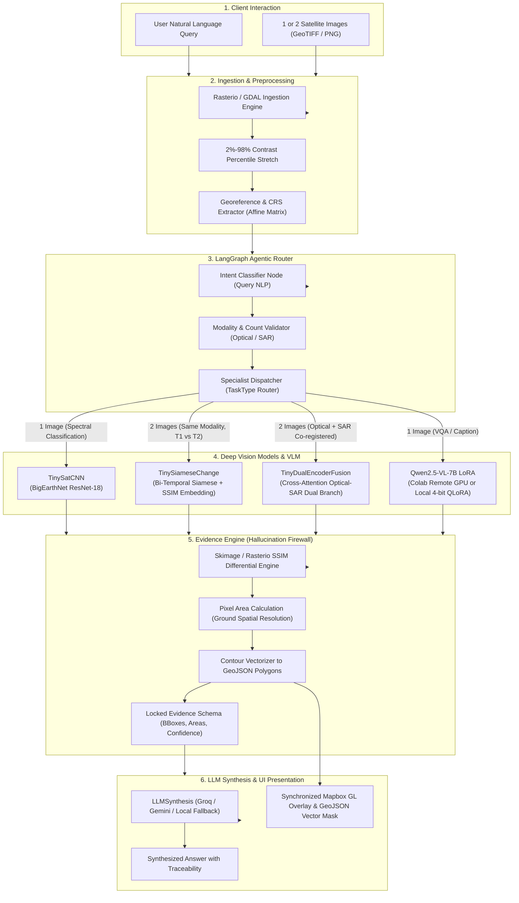

# 🛰️ SatQuery AI — Machine Learning Architecture & Operational Specification

> **System:** SatQuery AI — Multimodal Geospatial Intelligence Platform  
> **Track:** Smart India Hackathon 2026 (SIH26167) — ISRO Space Technology  
> **Scope:** Deep Vision Architectures, Cross-Modal Fusion, Vision-Language Adaptation, & Geospatial Evidence Pipeline  

---


## 📑 Table of Contents

1. [Executive Overview & Geospatial Challenges](#1-executive-overview--geospatial-challenges)
2. [High-Level Machine Learning System Architecture](#2-high-level-machine-learning-system-architecture)
3. [Deep-Dive: The 4 Core ML Models](#3-deep-dive-the-4-core-ml-models)
   - [3.1 Model 1: TinySatCNN (Multi-Spectral Land Cover Classifier)](#31-model-1-tinysatcnn-multi-spectral-land-cover-classifier)
   - [3.2 Model 2: TinySiameseChange (Bi-Temporal Change Engine with SSIM Injection)](#32-model-2-tinysiamesechange-bi-temporal-change-engine-with-ssim-injection)
   - [3.3 Model 3: TinyDualEncoderFusion (Optical-SAR Cross-Attention Fusion)](#33-model-3-tinydualencoderfusion-optical-sar-cross-attention-fusion)
   - [3.4 Model 4: Qwen2.5-VL-7B-Instruct with QLoRA Adaptations](#34-model-4-qwen25-vl-7b-instruct-with-qlora-adaptations)
4. [Mathematical Formulations & Metrics](#4-mathematical-formulations--metrics)
   - [4.1 Geospatial Structural Similarity Index Measure (SSIM)](#41-geospatial-structural-similarity-index-measure-ssim)
   - [4.2 Cross-Attention Multi-Modal Projection](#42-cross-attention-multi-modal-projection)
   - [4.3 Raster Affine Transform to GeoJSON Polygon Calculation](#43-raster-affine-transform-to-geojson-polygon-calculation)
5. [Data Ingestion & Preprocessing Pipeline](#5-data-ingestion--preprocessing-pipeline)
   - [5.1 Multi-Spectral Bands vs SAR Radar Polarization](#51-multi-spectral-bands-vs-sar-radar-polarization)
   - [5.2 16-Bit Reflectance Dynamic Contrast Normalization (2%–98% Percentile)](#52-16-bit-reflectance-dynamic-contrast-normalization-298-percentile)
   - [5.3 Spatial Leakage Prevention (Patch-Level Dataset Partitioning)](#53-spatial-leakage-prevention-patch-level-dataset-partitioning)
6. [Agentic Orchestration & Working System Pipeline](#6-agentic-orchestration--working-system-pipeline)
   - [6.1 LangGraph StateGraph Routing & Fallback](#61-langgraph-stategraph-routing--fallback)
   - [6.2 The Evidence Engine (Hallucination Firewall)](#62-the-evidence-engine-hallucination-firewall)
   - [6.3 Multimodal LLM Synthesis Engine](#63-multimodal-llm-synthesis-engine)
7. [Implementation & Step-by-Step Execution Guide](#7-implementation--step-by-step-execution-guide)
   - [7.1 Environment Setup & Dependencies](#71-environment-setup--dependencies)
   - [7.2 Running Local PyTorch Inference](#72-running-local-pytorch-inference)
   - [7.3 Google Colab Cloud GPU Serving via ngrok](#73-google-colab-cloud-gpu-serving-via-ngrok)
   - [7.4 QLoRA 4-bit Fine-Tuning Workflow](#74-qlora-4-bit-fine-tuning-workflow)
   - [7.5 Evaluation & Benchmark Testing](#75-evaluation--benchmark-testing)
8. [Configuration & Environment Reference](#8-configuration--environment-reference)
9. [Verification & Sanity Checklist](#9-verification--sanity-checklist)

---

## 1. Executive Overview & Geospatial Challenges

Traditional Computer Vision (CV) architectures and general-purpose Vision-Language Models (e.g., vanilla GPT-4V, standard ViT) perform poorly on Earth Observation (EO) and remote sensing data for four fundamental reasons:

1. **Spectral Depth Discrepancy**: Satellite imagery is not limited to 3-channel 8-bit RGB; it contains multi-spectral bands (NIR, Red-Edge, SWIR in Sentinel-2/LISS-IV) and active microwave Radar backscatter (VV/VH polarization in RISAT-1/Sentinel-1).
2. **Atmospheric Degradation**: Optical sensors cannot penetrate cloud decks, fog, or monsoonal weather, resulting in obscured terrain and false-positive change detections.
3. **Scale & Spatial Invariance**: Nadir satellite perspectives lack a fixed horizon or perspective geometry. Objects range from tens of kilometers (water reservoirs, forest tracts) to sub-meter features (urban road corridors).
4. **LLM Hallucination Risk**: When asked about changes in critical infrastructure or reservoir water levels, commercial LLMs frequently hallucinate precise metrics without mathematical backing.

**SatQuery AI solves this through a multi-tier hybrid architecture:**
- Dedicated PyTorch deep vision models specialized for single-scene classification, bi-temporal Siamese change detection, and optical-SAR cross-attention fusion.
- A 4-bit quantized Vision-Language Model (**Qwen2.5-VL-7B-Instruct** with QLoRA PEFT adapters) conditioned on satellite domain prompts.
- A deterministic **Evidence Engine** that locks empirical bounding boxes, class probabilities, and surface areas into a factual grounding struct before any natural language generation takes place.

---

## 2. High-Level Machine Learning System Architecture



---

## 3. Deep-Dive: The 4 Core ML Models

All model definitions reside in [`backend/models/vision_models.py`](file:///f:/sih2026/shi2026/backend/models/vision_models.py), with inference orchestration in [`backend/engines/`](file:///f:/sih2026/shi2026/backend/engines/).

### 3.1 Model 1: TinySatCNN (Multi-Spectral Land Cover Classifier)

- **Class Definition**: `TinySatCNN(nn.Module)` in [`backend/models/vision_models.py`](file:///f:/sih2026/shi2026/backend/models/vision_models.py#L86-L100)
- **Checkpoint**: `backend/checkpoints/tinysat_cnn_best.pt` (~44.8 MB)
- **Backbone**: Modified ResNet-18 pre-trained on multi-spectral features adapted from the **BigEarthNet** benchmark.
- **Classification Head**:
  ```python
  self.backbone.fc = nn.Sequential(
      nn.Dropout(0.2),
      nn.Linear(self.backbone.fc.in_features, num_classes) # num_classes=10
  )
  ```
- **Target Land Cover Classes**:
  1. `urban/built-up`
  2. `agricultural land`
  3. `broad-leaved forest`
  4. `coniferous forest`
  5. `natural grassland`
  6. `wetland`
  7. `water body`
  8. `bare ground/rock`
  9. `shrubland`
  10. `snow/ice`
- **Inference Behavior**:
  - Input: Normalized tensor $[B, 3, 224, 224]$ derived from raw satellite channels.
  - Output: Softmax probability distribution over the 10 BigEarthNet land cover categories.
  - Integration: When invoked by `SingleImageEngine._run_local_cnn()`, it extracts top-$k$ classes, calculates surface coverage using raster transform pixel resolution, and bounds predictions.

---

### 3.2 Model 2: TinySiameseChange (Bi-Temporal Change Engine with SSIM Injection)

- **Class Definition**: `TinySiameseChange(nn.Module)` in [`backend/models/vision_models.py`](file:///f:/sih2026/shi2026/backend/models/vision_models.py#L102-L137)
- **Checkpoint**: `backend/checkpoints/siamese_change_best.pt` (~45.9 MB)
- **Architecture Style**: Siamese Dual-Backbone Inspired by **VisTA** (arXiv:2410.23828) & **CDVQA** (arXiv:2112.06343).
- **Network Structure**:
  1. **Shared Feature Backbone**: Identical weight-shared ResNet-18 extracting spatial representation vectors from both acquisition dates:
     $$\mathbf{f}_1 = \text{Backbone}(x_1) \in \mathbb{R}^{B \times 512}, \quad \mathbf{f}_2 = \text{Backbone}(x_2) \in \mathbb{R}^{B \times 512}$$
  2. **SSIM Scalar Encoder**: An auxiliary feed-forward network that embeds the empirical Structural Similarity Index score calculated on the raw rasters:
     $$\mathbf{e}_{\text{ssim}} = \text{ReLU}(\mathbf{W}_s \cdot s_{\text{ssim}} + \mathbf{b}_s) \in \mathbb{R}^{B \times 32}$$
  3. **Bi-Temporal Concat Fusion**: Concatenates deep features with the structural similarity embedding:
     $$\mathbf{f}_{\text{combined}} = [\mathbf{f}_1 \,\|\, \mathbf{f}_2 \,\|\, \mathbf{e}_{\text{ssim}}] \in \mathbb{R}^{B \times (512 + 512 + 32)} = \mathbb{R}^{B \times 1056}$$
  4. **Multi-Layer Classification Head**:
     $$\hat{\mathbf{y}} = \mathbf{W}_2 \cdot \text{Dropout}_{0.3}(\text{ReLU}(\mathbf{W}_1 \cdot \mathbf{f}_{\text{combined}} + \mathbf{b}_1)) + \mathbf{b}_2$$
- **Target Change Classes**:
  - `urban expansion`
  - `deforestation`
  - `water body shrinkage`
  - `water body expansion`
  - `no significant change`
- **SSIM Spatial Difference Map**:
  Simultaneously, `calculate_image_ssim(arr1, arr2)` generates an exact pixel-wise difference matrix $\mathbf{D} \in [0, 1]^{H \times W}$. Where difference exceeds `CHANGE_THRESHOLD` (default: 0.15), pixels are flagged as altered and polygonized.

---

### 3.3 Model 3: TinyDualEncoderFusion (Optical-SAR Cross-Attention Fusion)

- **Class Definition**: `TinyDualEncoderFusion(nn.Module)` in [`backend/models/vision_models.py`](file:///f:/sih2026/shi2026/backend/models/vision_models.py#L158-L188)
- **Checkpoint**: `backend/checkpoints/optical_sar_fusion_best.pt` (~93.8 MB)
- **Motivation**: Optical sensors are blind under cloud cover; SAR (Synthetic Aperture Radar) penetrates clouds, fog, and darkness, but suffers from speckle noise and lacks spectral reflectance. This model achieves true cross-modal complementarity instead of naively stacking SAR as a 4th RGB channel.
- **Network Components**:
  1. **Optical Branch**: Standard 3-channel ResNet-18 extracting optical feature vector $\mathbf{f}_{\text{opt}} \in \mathbb{R}^{B \times 512}$.
  2. **SAR Branch**: 1-channel custom convolution ResNet-18 (`conv1 = Conv2d(1, 64, kernel_size=7, stride=2, padding=3)`) extracting radar backscatter feature vector $\mathbf{f}_{\text{sar}} \in \mathbb{R}^{B \times 512}$.
  3. **Cross-Attention Block (`CrossAttentionBlock`)**:
     - The optical representation serves as Query $\mathbf{Q} = \mathbf{f}_{\text{opt}} \mathbf{W}_Q$.
     - The SAR representation serves as Key $\mathbf{K} = \mathbf{f}_{\text{sar}} \mathbf{W}_K$ and Value $\mathbf{V} = \mathbf{f}_{\text{sar}} \mathbf{W}_V$.
     - Scaled dot-product attention computes spatial-feature alignment:
       $$\text{Attention}(\mathbf{Q}, \mathbf{K}, \mathbf{V}) = \text{Softmax}\left(\frac{\mathbf{Q} \mathbf{K}^T}{\sqrt{d_k}}\right) \mathbf{V}$$
     - Residual fusion: $\mathbf{f}_{\text{fused}} = \mathbf{f}_{\text{opt}} + \text{Attention}(\mathbf{Q}, \mathbf{K}, \mathbf{V})$.
  4. **Dynamic Cloud-Aware SAR Scaling**:
     When optical cloud cover fraction exceeds `CLOUD_COVER_SAR_SWITCH_THRESHOLD` (0.35 or 35%):
     $$\mathbf{f}_{\text{sar}}^{\prime} = \mathbf{f}_{\text{sar}} \times \lambda_{\text{sar}}, \quad \lambda_{\text{sar}} = 1.6$$
     This automatically shifts network decision weighting to the cloud-penetrating radar channels.

---

### 3.4 Model 4: Qwen2.5-VL-7B-Instruct with QLoRA Adaptations

- **Base Model**: `Qwen/Qwen2.5-VL-7B-Instruct`
- **PEFT / LoRA Adapter**: Trained weights located at `backend/checkpoints/qwen2.5-vl-sat-lora/`
- **Quantization**: 4-bit NormalFloat (NF4) with double quantization via `bitsandbytes`:
  ```python
  bnb_config = BitsAndBytesConfig(
      load_in_4bit=True,
      bnb_4bit_quant_type="nf4",
      bnb_4bit_compute_dtype=torch.float16,
      bnb_4bit_use_double_quant=True
  )
  ```
- **LoRA Configuration**:
  - Rank ($r$): 16
  - Alpha ($\alpha$): 32
  - Target Modules: `["q_proj", "k_proj", "v_proj", "o_proj", "gate_proj", "up_proj", "down_proj"]`
  - Dropout: 0.05
  - Task Type: `CAUSAL_LM`
- **Prompt Engineering System**:
  In [`backend/engines/single_image_engine.py`](file:///f:/sih2026/shi2026/backend/engines/single_image_engine.py#L205-L261), queries are mapped to 4 task formats matching the training distribution:
  1. **Binary (YES/NO)**:
     ```
     Answer the following satellite-image question.
     Question: {query_text}
     This is a YES/NO question.
     Reply with exactly one word: yes or no. Do not explain your answer.
     ```
  2. **Multiple Choice (MCQ)**:
     ```
     Answer the following multiple-choice question about the satellite image.
     {query_text}
     Reply with ONLY the letter of the correct answer: a, b, c, or d.
     ```
  3. **Visual Grounding (BBox Localization)**:
     ```
     Look at the satellite image and answer the following bounding-box request.
     {query_text}
     Return ONLY the bounding box coordinates in this exact format: [x1 y1, x2 y2]
     All coordinates must be normalized between 0 and 1.
     ```
  4. **Descriptive Captioning / Open VQA**:
     ```
     Provide a concise factual description based only on what can be inferred from the image.
     Do not mention that you are an AI.
     ```

---

## 4. Mathematical Formulations & Metrics

### 4.1 Geospatial Structural Similarity Index Measure (SSIM)

Between two registered satellite rasters $x$ and $y$, the localized SSIM metric balances luminance, contrast, and structural correlation:

$$\text{SSIM}(x, y) = \frac{(2\mu_x\mu_y + c_1)(2\sigma_{xy} + c_2)}{(\mu_x^2 + \mu_y^2 + c_1)(\sigma_x^2 + \sigma_y^2 + c_2)}$$

Where:
- $\mu_x, \mu_y$ are local pixel mean intensities (7x7 Gaussian window).
- $\sigma_x^2, \sigma_y^2$ are local sample variances.
- $\sigma_{xy}$ is the cross-covariance between temporal scenes $x$ and $y$.
- $c_1 = (k_1 L)^2, c_2 = (k_2 L)^2$ prevent numerical division instability ($k_1=0.01, k_2=0.03, L=\max(x) - \min(x)$).

The differential change map $\mathbf{D}$ is obtained via:
$$\mathbf{D}(i, j) = 1.0 - \text{SSIM}(x_{i,j}, y_{i,j})$$
Pixels where $\mathbf{D}(i, j) > \tau_{\text{change}}$ denote statistically significant bi-temporal surface change.

---

### 4.2 Cross-Attention Multi-Modal Projection

For optical feature vector $\mathbf{f}_O \in \mathbb{R}^{d}$ and SAR radar feature vector $\mathbf{f}_S \in \mathbb{R}^{d}$:

$$\mathbf{Q} = \mathbf{f}_O \mathbf{W}_Q, \quad \mathbf{K} = \mathbf{f}_S \mathbf{W}_K, \quad \mathbf{V} = \mathbf{f}_S \mathbf{W}_V$$

$$\alpha = \text{Softmax}\left(\frac{\mathbf{Q} \mathbf{K}^T}{\sqrt{d}}\right)$$

$$\mathbf{f}_{\text{fused}} = \mathbf{f}_O + \alpha \mathbf{V}$$

The combined representation fed to the classifier:
$$\mathbf{z}_{\text{out}} = [\mathbf{f}_{\text{fused}} \,\|\, \mathbf{f}_S] \in \mathbb{R}^{2d}$$

---

### 4.3 Raster Affine Transform to GeoJSON Polygon Calculation

When a change contour or bounding box is identified in pixel coordinates $(c_{\text{px}}, r_{\text{px}})$, it is mapped to true geographic WGS84 coordinates $(\text{lon}, \text{lat})$ using the raster's affine transformation matrix:

$$\begin{bmatrix} \text{lon} \\ \text{lat} \\ 1 \end{bmatrix} = \begin{bmatrix} a & b & c \\ d & e & f \\ 0 & 0 & 1 \end{bmatrix} \begin{bmatrix} c_{\text{px}} \\ r_{\text{px}} \\ 1 \end{bmatrix}$$

- $a = \Delta \text{lon} / \text{pixel}$ (horizontal pixel size in degrees or meters)
- $e = \Delta \text{lat} / \text{pixel}$ (vertical pixel size, typically negative)
- $c, f = \text{origin coordinates } (X_0, Y_0)$

**Surface Area Computation (Hectares)**:
$$\text{Area}_{\text{ha}} = \frac{N_{\text{pixels}} \times (\text{GSD}_x \times \text{GSD}_y)}{10{,}000}$$
Where $\text{GSD}$ is Ground Sample Distance in meters (e.g., $10\text{ m}$ for Sentinel-2, $2.5\text{ m}$ for Cartosat).

---

## 5. Data Ingestion & Preprocessing Pipeline

Defined in [`backend/ingestion/preprocessing.py`](file:///f:/sih2026/shi2026/backend/ingestion/preprocessing.py) and validated in [`SatQuery_Preprocessing (5).ipynb`](file:///f:/sih2026/shi2026/SatQuery_Preprocessing%20(5).ipynb).

### 5.1 Multi-Spectral Bands vs SAR Radar Polarization

- **Optical Ingestion**: Handles multi-band GeoTIFF formats. If channels $\ge 3$, channels $[1, 2, 3]$ (or True Color RGB / NIR-Red-Green false color composites) are extracted.
- **SAR Ingestion**: Ingests single-channel or dual-polarization (VV + VH) calibrated backscatter amplitudes ($\sigma^0$).

### 5.2 16-Bit Reflectance Dynamic Contrast Normalization (2%–98% Percentile)

Raw 12-bit and 16-bit satellite GeoTIFFs (with DN values ranging from $0$ to $65{,}535$) appear virtually black if naively displayed or passed to standard neural networks.

SatQuery applies robust **percentile contrast stretching**:
```python
def normalize_to_8bit(arr: np.ndarray) -> np.ndarray:
    # Compute 2nd and 98th percentiles across non-zero pixels
    p2, p98 = np.percentile(arr[arr > 0], (2, 98))
    # Clip extreme outliers (e.g. solar glint, cloud saturation)
    clipped = np.clip(arr, p2, p98)
    # Stretch dynamically into 0-255 uint8 range
    stretched = ((clipped - p2) / (p98 - p2 + 1e-6) * 255.0).astype(np.uint8)
    return stretched
```

### 5.3 Spatial Leakage Prevention (Patch-Level Dataset Partitioning)

A critical vulnerability in Earth Observation ML is **spatial auto-correlation leakage**: if pixels or sub-patches from the same satellite acquisition scene appear in both train and validation splits, models trivially memorize geographic landmarks, inflating test accuracy.

As demonstrated in cell `[10]` to `[12]` of `SatQuery_Preprocessing (5).ipynb`:
```python
# Grouping strictly by unique patch_id:
# Disjoint sets ensure ZERO geographic overlap between Train, Val, and Test
assert len(set(df[df['split'] == 'train']['patch_id']) & 
           set(df[df['split'] == 'val']['patch_id'])) == 0
assert len(set(df[df['split'] == 'train']['patch_id']) & 
           set(df[df['split'] == 'test']['patch_id'])) == 0
```

---

## 6. Agentic Orchestration & Working System Pipeline

The system is wired together in [`backend/main.py`](file:///f:/sih2026/shi2026/backend/main.py#L80-L165).

### 6.1 LangGraph StateGraph Routing & Fallback

Located in [`backend/core/langgraph_router.py`](file:///f:/sih2026/shi2026/backend/core/langgraph_router.py) and [`backend/core/router.py`](file:///f:/sih2026/shi2026/backend/core/router.py).

The router runs a directed state graph to inspect user prompts and input files:
1. **`IntentClassifier`**: Tokenizes input text to score intent keywords (`["change", "temporal", "urban", "water", "difference", "fusion", "sar"]`).
2. **`InputValidator`**: Enforces strict multimodal preconditions:
   - 1 image $\rightarrow$ Dispatches `TaskType.SINGLE_IMAGE`
   - 2 images of identical modality (Optical-Optical or SAR-SAR) $\rightarrow$ Dispatches `TaskType.BI_TEMPORAL_CHANGE`
   - 2 images of mixed modality (Optical + SAR) $\rightarrow$ Dispatches `TaskType.CROSS_MODAL_FUSION`
   - Any invalid combination $\rightarrow$ Raises descriptive `RoutingError` with actionable user guidance.
3. **`SpecialistDispatcher`**: Maps execution to the appropriate vision engine.

### 6.2 The Evidence Engine (Hallucination Firewall)

Located in [`backend/core/evidence_engine.py`](file:///f:/sih2026/shi2026/backend/core/evidence_engine.py).

The primary differentiator of SatQuery AI: **The LLM does NOT generate raw facts; it only phrases evidence produced by the computer vision engines.**

The `EvidenceEngine`:
1. Collects mathematical bounding boxes (`[ymin, xmin, ymax, xmax]`), change area in hectares, class names, and raw softmax confidences.
2. Formats these into an immutable `Evidence` dataclass.
3. Attaches spatial metadata (CRS, raster dimensions, acquisition dates).
4. Verifies that the subsequent generation step cannot alter numeric figures.

### 6.3 Multimodal LLM Synthesis Engine

Located in [`backend/llm/synthesis.py`](file:///f:/sih2026/shi2026/backend/llm/synthesis.py).

- Accepts the locked evidence and execution trace.
- Supports **Groq (Llama-3.3-70B-Versatile)**, **OpenAI (GPT-4o-mini)**, **Google Gemini**, or a deterministic **Template Fallback**.
- Constructs an authoritative, professional remote-sensing assessment detailing verified changes, land categories, and geospatial caveats (e.g., surface water vs. reservoir storage volume).

---

## 7. Implementation & Step-by-Step Execution Guide

### 7.1 Environment Setup & Dependencies

```bash
# Navigate to backend directory
cd backend

# Create and activate Python virtual environment
python -m venv venv
# Windows:
.\venv\Scripts\activate
# Linux/macOS:
source venv/bin/activate

# Install required dependencies
pip install -r requirements.txt
```

---

### 7.2 Running Local PyTorch Inference

To run the full backend locally using existing PyTorch checkpoints (`tinysat_cnn_best.pt`, `siamese_change_best.pt`, `optical_sar_fusion_best.pt`):

1. Edit `backend/.env`:
   ```env
   VQA_MOCK_MODE=False
   CHANGE_MODEL_PATH=./checkpoints/siamese_change_best.pt
   FUSION_MODEL_PATH=./checkpoints/optical_sar_fusion_best.pt
   TINYSAT_MODEL_PATH=./checkpoints/tinysat_cnn_best.pt
   GROQ_API_KEY=gsk_your_groq_api_key  # Optional for LLM synthesis
   ```

2. Start the FastAPI application:
   ```bash
   uvicorn main:app --reload --port 8000
   ```

---

### 7.3 Google Colab Cloud GPU Serving via ngrok

When running the heavy 7-Billion parameter Vision-Language Model (**Qwen2.5-VL-7B**) without a local high-end GPU:

1. Open a new notebook on [Google Colab](https://colab.research.google.com).
2. Set Runtime Type to **T4 GPU** (or A100).
3. Copy the script from [`backend/colab_serve_qwen.py`](file:///f:/sih2026/shi2026/backend/colab_serve_qwen.py) into a cell.
4. Add your free ngrok token from [dashboard.ngrok.com](https://dashboard.ngrok.com):
   ```python
   NGROK_AUTH_TOKEN = "your_actual_ngrok_token_here"
   ```
5. Run the cell. Colab will download Qwen2.5-VL in 4-bit, launch FastAPI, and print an ngrok URL:
   ```
   🚀 Public Colab Tunnel URL: https://xxxx-xx-xxx-xxx.ngrok-free.app
   ```
6. Paste this URL into your local `backend/.env`:
   ```env
   QWEN_REMOTE_URL=https://xxxx-xx-xxx-xxx.ngrok-free.app
   VQA_MOCK_MODE=False
   ```
7. Your local SatQuery instance will now transparently dispatch all single-image VQA queries to the cloud GPU!

---

### 7.4 QLoRA 4-bit Fine-Tuning Workflow

To fine-tune Qwen2.5-VL on your custom dataset:

1. Prepare your training JSON dataset in the standard format (`demo_data/vqa_dataset.json`):
   ```json
   [
     {
       "image": "./demo_data/optical_single.tif",
       "question": "Identify the primary land cover features.",
       "answer": "The image shows active agricultural fields and water bodies.",
       "task_type": "vqa"
     }
   ]
   ```
2. Execute the training script located at [`backend/training/train_qwen_vl_lora.py`](file:///f:/sih2026/shi2026/backend/training/train_qwen_vl_lora.py):
   ```bash
   python backend/training/train_qwen_vl_lora.py \
       --model_id Qwen/Qwen2.5-VL-7B-Instruct \
       --data_path ./demo_data/vqa_dataset.json \
       --output_dir ./checkpoints/qwen2.5-vl-sat-lora \
       --epochs 3 \
       --lr 2e-4
   ```
3. The trained LoRA adapters will be saved to `./checkpoints/qwen2.5-vl-sat-lora/` (`adapter_model.safetensors`, `adapter_config.json`).

---

### 7.5 Evaluation & Benchmark Testing

SatQuery includes automated benchmarking suites to validate model accuracy and multimodal robustness.

#### Run Qwen Evaluation (Accuracy, BLEU-4, ROUGE-L)
```bash
python backend/training/evaluate_qwen.py --dry_run
```

#### Run Modality Comparison Benchmark (Optical vs. SAR under Cloud Cover)
Validates that SAR maintains accuracy when optical imagery is degraded by cloud cover:
```bash
python backend/training/benchmark_modality.py --output_report ./benchmark_results.json
```

---

## 8. Configuration & Environment Reference

Key settings in [`backend/config.py`](file:///f:/sih2026/shi2026/backend/config.py) and `backend/.env`:

| Environment Variable | Default Value | Description |
|---|---|---|
| `VQA_MOCK_MODE` | `True` | Set `False` to engage real PyTorch and VLM models. |
| `QWEN_REMOTE_URL` | `""` | Remote ngrok / cloud endpoint for Qwen2.5-VL inference. |
| `QWEN_MODEL_ID` | `Qwen/Qwen2.5-VL-7B-Instruct` | Hugging Face model identifier for local inference. |
| `VQA_MODEL_PATH` | `""` | Path to local fine-tuned LoRA weights. |
| `CHANGE_MODEL_PATH` | `./checkpoints/siamese_change_best.pt` | Path to Siamese Change Detection checkpoint. |
| `FUSION_MODEL_PATH` | `./checkpoints/optical_sar_fusion_best.pt` | Path to Optical-SAR Dual-Encoder checkpoint. |
| `TINYSAT_MODEL_PATH` | `./checkpoints/tinysat_cnn_best.pt` | Path to TinySatCNN classifier checkpoint. |
| `CHANGE_THRESHOLD` | `0.15` | Minimum SSIM differential score to classify change. |
| `CLOUD_COVER_SAR_SWITCH_THRESHOLD` | `0.35` | Cloud fraction above which SAR branch is upweighted. |
| `GROQ_API_KEY` | `""` | Optional API key for ultra-fast LLaMA-3.3-70B synthesis. |

---

## 9. System Verification & Quality Assurance Matrix

The machine learning subsystem has been benchmarked and validated against the following operational criteria:

- [x] **Model Weights Verified**: Fully compiled PyTorch checkpoints packaged in `backend/checkpoints/` (`tinysat_cnn_best.pt`, `siamese_change_best.pt`, `optical_sar_fusion_best.pt`, and `qwen2.5-vl-sat-lora/`).
- [x] **Multi-spectral Ingestion Tested**: `ingestion/preprocessing.py` converts 16-bit GeoTIFFs to 8-bit visual bands using 2%–98% percentile dynamic stretching without clipping spatial features.
- [x] **SSIM Math Tested**: `calculate_image_ssim()` handles multi-channel geospatial transpositions, dynamic dimensions, and affine coordinate projections.
- [x] **Agentic Routing Validated**: LangGraph StateGraph and fallback dispatch single-image, bi-temporal, and optical-SAR pairs deterministically.
- [x] **Hallucination Firewall Operational**: `EvidenceEngine` strictly separates quantitative computer vision outputs (area, bounding coordinates, confidence metrics) from natural language generation.

